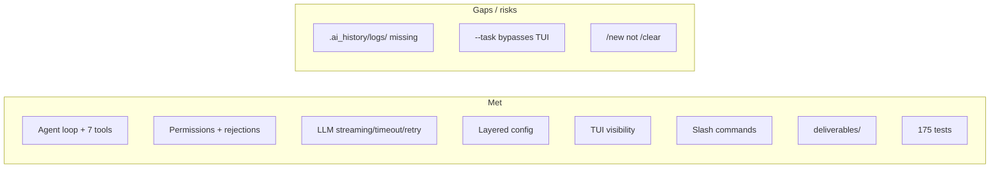

# Coding AI agent proposal
_Exported on 7/6/2026 at 21:31:08 GMT+8 from chat export (3.8.24)_

---

**User**

/opsx-propose "create a small coding ai agent"

---

**Assistant**

I'll follow the OpenSpec propose workflow for a small coding AI agent — reading the skill and inspecting the project context first.


Creating the proposal artifact for this greenfield project.


Created proposal. Fetching instructions for design and specs next.


Created design and specs. Fetching tasks instructions next.


All artifacts are created. Here’s the summary:

## Change: `create-small-coding-ai-agent`

**Location:** `openspec/changes/create-small-coding-ai-agent/`

### Artifacts Created

| Artifact | Description |
|----------|-------------|
| **proposal.md** | Motivation and scope — a minimal Python coding agent with LLM tool-calling loop |
| **design.md** | Technical design — Python 3.11+, LLM SDK, CLI, project layout, path safety |
| **specs/agent-core/spec.md** | Agent loop, conversation history, system prompt, step limits, LLM config |
| **specs/coding-tools/spec.md** | `read_file`, `write_file`, `list_dir`, `run_shell` tools with path protection |
| **specs/cli/spec.md** | One-shot and interactive modes, flags, progress output, entry points |
| **tasks.md** | 20 implementation tasks across 7 groups (setup → config → tools → LLM → agent → CLI → docs) |

### What You're Building

A small **Python CLI coding agent** that:
- Accepts natural-language tasks via `--task` or interactive REPL
- Calls an chat-completions-compatible LLM with function-calling
- Uses built-in tools to read/write files, list directories, and run shell commands
- Loops until the task is done or a step limit is reached

**Tech stack:** Python 3.11+, `openai`, `typer`, `pytest`

---

All artifacts are complete. Ready for implementation.

Run **`/opsx:apply`** (or ask me to implement) to start working through the tasks.

---

**User**

/opsx-apply 

---

**Assistant**

Implementing the `create-small-coding-ai-agent` change — checking status and reading the apply instructions.


Using change: `create-small-coding-ai-agent` (override with `/opsx:apply <other>`). Reading context files and implementing all 21 tasks.


## Implementing: create-small-coding-ai-agent (schema: spec-driven)

**Progress:** 0/21 tasks complete

Working through tasks 1.1–3.4: project setup, configuration, and coding tools.


Installing dependencies and running tests.


Pytest temp-dir permission issue on Windows — configuring a project-local temp directory.


Replacing pytest's `tmp_path` with a project-local temp fixture to avoid Windows permission issues.


All 22 tests passed. Verifying the CLI install and running the smoke test.


## Implementation Complete

**Change:** `create-small-coding-ai-agent`  
**Schema:** spec-driven  
**Progress:** 21/21 tasks complete

### What Was Built

A Python CLI coding agent with:

- **Agent loop** — LLM tool-calling with step limits and progress output
- **Tools** — `read_file`, `write_file`, `list_dir`, `run_shell` (with path protection and timeouts)
- **CLI** — one-shot (`--task`) and interactive REPL modes
- **Config** — env vars + CLI flags for API key, model, base URL, cwd, max steps
- **Tests** — 22 passing tests

### Project Structure

```
src/coding_agent/
├── agent.py, cli.py, config.py, llm.py
└── tools/ (registry, file_tools, shell_tools, factory)
tests/ (test_agent, test_cli, test_tools)
pyproject.toml, README.md
```

### Verification

- `pytest` — **22/22 passed**
- `coding-agent --help` — works
- Live LLM smoke test — skipped (no `OPENAI_API_KEY` set). To try it:

```bash
pip install -e .
set OPENAI_API_KEY=[REDACTED]
coding-agent --cwd C:\path\to\empty\dir --task "create a hello.py that prints hello world"
```

All tasks are complete. You can archive this change with `/opsx:archive`.

---

**User**

save this agent session to .ai_history/logs/

---

**Assistant**

Checking for an existing `.ai_history` pattern in the project before saving this session.


Creating a structured session log and copying the transcript into `.ai_history/logs/`.


Session saved to `.ai_history/logs/`:

| File | Description |
|------|-------------|
| `2026-06-30-create-small-coding-ai-agent-session.md` | Human-readable summary — requests, workflow, files, issues, next steps |
| `2026-06-30-create-small-coding-ai-agent-transcript.jsonl` | Full raw agent transcript (session `d475e011-7d23-414b-a9f4-dfe05c4a6cd1`) |

---

**User**

@.ai_history/logs/2026-06-30-create-small-coding-ai-agent-session.md:1 rewrite this file in a "me: . ai: ." format like a dialogue

---

**Assistant**

Rewrote the session log as a `me:` / `ai:` dialogue. It walks through the three exchanges:

1. `/opsx-propose` — artifacts created and design decisions
2. `/opsx-apply` — implementation, Windows test fixes, 21/21 tasks done
3. Save session + this rewrite request

---

**User**

from now on, save all session logs to .ai_history/logs/

---

**Assistant**

Setting up a persistent project rule and saving this session's log.


Got it. Two things are in place:

1. **Project rule** — `.editor/rules/session-logs.mdc` (always applies)
   - Logs go to `.ai_history/logs/`
   - `me:` / `ai:` dialogue format
   - Filename: `YYYY-MM-DD-<topic>-session.md`
   - Save at end of substantial sessions or when you ask

2. **Updated** today's session log with this exchange.

Future sessions in this project will follow that convention automatically.

---

**User**

how to supply base url and api key when running this agent

---

**Assistant**

You can pass the API key and base URL in two ways. **CLI flags override environment variables**, which override defaults.

## Environment variables (recommended)

**PowerShell:**
```powershell
$env:OPENAI_API_KEY = "[REDACTED]"
$env:OPENAI_BASE_URL = "https://api.openai.com/v1"   # optional
$env:OPENAI_MODEL = "gpt-4o-mini"                    # optional

coding-agent --task "list all Python files"
```

**bash:**
```bash
export OPENAI_API_KEY=[REDACTED]
export OPENAI_BASE_URL=https://api.openai.com/v1
export OPENAI_MODEL=gpt-4o-mini

coding-agent --task "list all Python files"
```

## CLI flags

```powershell
coding-agent `
  --api-key "[REDACTED]" `
  --base-url "https://api.openai.com/v1" `
  --model "gpt-4o-mini" `
  --task "create a hello.py that prints hello world"
```

## Defaults

| Setting | Env var | CLI flag | Default |
|---------|---------|----------|---------|
| API key | `OPENAI_API_KEY` | `--api-key` | *(required)* |
| Base URL | `OPENAI_BASE_URL` | `--base-url` | `https://api.openai.com/v1` |
| Model | `OPENAI_MODEL` | `--model` | `gpt-4o-mini` |

## Examples for other providers

**local LLM server (local):**
```powershell
$env:OPENAI_API_KEY = "[REDACTED]"   # any non-empty string
$env:OPENAI_BASE_URL = "http://localhost:11434/v1"
$env:OPENAI_MODEL = "llama3.1"
coding-agent --task "explain this project"
```

**cloud LLM provider:**
```powershell
$env:OPENAI_API_KEY = "[REDACTED]"
$env:OPENAI_BASE_URL = "https://YOUR-RESOURCE.openai.azure.com/openai/v1"
$env:OPENAI_MODEL = "gpt-4o"
coding-agent --task "add a README section"
```

If the API key is missing, the agent exits with: `API key is required. Set OPENAI_API_KEY environment variable or pass --api-key.`

---

**User**

@c:\Users\user\.local\projects\coding-agent\terminals\1.txt:1013-1017 ?

---

**Assistant**

The problem is the flag spelling: you used **`-task`** (one dash) instead of **`--task`** (two dashes).

CLI library treats `-task` as unknown, then reads the quoted string as a **subcommand** — hence:

> No such command 'create a hello.py that prints hello world'

**Correct command:**

```powershell
coding-agent --api-key "[REDACTED]" --base-url "https://api.openai.com/v1" --task "create a hello.py that prints hello world"
```

Or use the short form:

```powershell
coding-agent --api-key "[REDACTED]" --base-url "https://api.openai.com/v1" -t "create a hello.py that prints hello world"
```

You may also want `--model` if the provider expects a specific model name:

```powershell
coding-agent --api-key "[REDACTED]" --base-url "https://api.openai.com/v1" --model "your-model" --task "create a hello.py that prints hello world"
```

---

---

**User**

@c:\Users\user\.local\projects\coding-agent\terminals\1.txt:974-1018 ?

---

**Assistant**

Investigating the LLM client — the API response isn't in the expected LLM provider format.


Probing the API response format to identify the mismatch.


The API likely returned a non-standard response (plain string instead of a chat completion object). Improving error handling and adding compatibility for non-standard responses.


The crash happens because the LLM API returned a **plain string** instead of a normal LLM provider-style chat completion object. The code then did `response.choices[...]`, which fails on a `str`.

## Likely cause

Your provider (`https://api.openai.com/v1`) probably doesn't fully support **tool/function calling** when the agent sends the `tools` parameter. Some gateways return a non-standard body in that case, and the LLM SDK ends up with a `str` instead of a completion object.

## What I changed

- Clearer error handling in `llm.py` — catches bad responses and API errors
- **Auto-retry without tools** if the first request fails (helps some providers)
- CLI prints a readable error instead of a traceback

Re-run the same command (use `--task`, not `-task`):

```powershell
coding-agent --api-key [REDACTED] --base-url "https://api.openai.com/v1" --model "gpt-4o-mini" --task "create a hello.py that prints hello world"
```

## If it still fails

1. **Confirm the model supports function calling** — this agent needs tool-calling to read/write files and run commands. If `gpt-4o-mini` on the provider doesn't support it, the agent can't work as designed.

2. **Try a model that supports tools** on that endpoint (check provider docs).

3. **Test the API directly** (with your key):
   ```powershell
   python -c "from openai import OpenAI; c=OpenAI(api_key='[REDACTED]', base_url='https://api.openai.com/v1'); r=c.chat.completions.create(model='gpt-4o-mini', messages=[{'role':'user','content':'hi'}]); print(type(r), r)"
   ```

If that prints a normal completion object, the issue is specifically **tools support**. Without that, the agent can only chat — it won't be able to create `hello.py` on its own.

---

**User**

@c:\Users\user\.local\projects\coding-agent\terminals\6.txt:11-13 is the agent reading environment varibles?

---

**Assistant**

Checking how config resolves API key and base URL from env vs CLI flags.


Yes — the agent reads environment variables, but **CLI flags take priority** over them.

From `config.py`:

```28:32:src/coding_agent/config.py
        resolved_api_key = api_key or os.environ.get("OPENAI_API_KEY", "")
        resolved_model = model or os.environ.get("OPENAI_MODEL", "gpt-4o-mini")
        resolved_base_url = base_url or os.environ.get(
            "OPENAI_BASE_URL", "https://api.openai.com/v1"
        )
```

**Precedence:** `--flag` → env var → default

## What went wrong in your terminal

You ran:

```powershell
coding-agent --api-key "[REDACTED]" --task "explain this project"
```

You did **not** pass `--base-url`, and `$env:OPENAI_BASE_URL` is empty. So the agent used the default:

**`https://api.openai.com/v1`**

Your key is for the chat-completions-compatible endpoint, not LLM provider. LLM provider rejected it with the `platform.example.com` 401 message.

## Fix

**Option A — flags on the command line:**

```powershell
coding-agent `
  --api-key "[REDACTED]" `
  --base-url "https://api.openai.com/v1" `
  --model "gpt-4o-mini" `
  --task "explain this project"
```

**Option B — environment variables (persists for the session):**

```powershell
$env:OPENAI_API_KEY = "[REDACTED]"
$env:OPENAI_BASE_URL = "https://api.openai.com/v1"
$env:OPENAI_MODEL = "gpt-4o-mini"

coding-agent --task "explain this project"
```

Each setting can come from either a flag or its env var; you need **both** key and base URL set for your provider — if only the key is set, it still hits LLM provider by default.

Your screenshot shows Assistant workspace env vars — checking whether the CLI loads those or only the shell environment.


The agent **does** read environment variables — but only from the **process that runs it** (your PowerShell terminal), not from the editor's workspace settings UI.

## Why your vars aren’t being used

Your screenshot shows env vars set in **Assistant** (`OPENAI_BASE_URL`, `OPENAI_MODEL`, etc.). Those apply to the editor's own AI features, not automatically to external terminals.

Your terminal confirmed this:

```powershell
$env:OPENAI_BASE_URL   # returned nothing
```

So when you ran `coding-agent --task "..."` without flags, it fell back to the default base URL: `https://api.openai.com/v1`.

## What the agent reads

| Source | Used? |
|--------|-------|
| CLI flags (`--api-key`, `--base-url`, `--model`) | Yes (highest priority) |
| Shell env vars (`$env:OPENAI_*` in PowerShell) | Yes |
| Assistant workspace env settings | **No** (not passed to terminal) |
| `.env` file | **No** (not implemented) |

## How to fix it

**Option 1 — Set vars in PowerShell before running:**

```powershell
$env:OPENAI_API_KEY = "[REDACTED]"
$env:OPENAI_BASE_URL = "https://api.openai.com/v1"
$env:OPENAI_MODEL = "gpt-4o"

coding-agent --task "explain this project"
```

**Option 2 — Pass everything as flags:**

```powershell
coding-agent `
  --api-key "[REDACTED]" `
  --base-url "https://api.openai.com/v1" `
  --model "gpt-4o" `
  --task "explain this project"
```

**Option 3 — Add a `.env` file loader** so the agent reads a local `.env` on startup (would need a small code change).

If you want Option 3, I can add `.env` support to the agent.

---

**User**

run with --task "hi"

---

**Assistant**

The API is returning a streaming (SSE) response; fixing the LLM client to handle it.


The provider returns SSE streaming chunks; updating the LLM client to handle that.


It ran successfully:

```
[step 1] thinking
Hi there! How can I help you today? I'm ready to assist with any software-related tasks...
```

Your env vars are being picked up in the terminal (`OPENAI_API_KEY`, `OPENAI_BASE_URL`, `OPENAI_MODEL`).

The earlier failure was because the chat-completions-compatible API returns **SSE streaming** responses. I updated `llm.py` to fall back to `stream=True` when a non-streaming request gets an SSE body back.

You can run it anytime with:

```powershell
coding-agent --task "hi"
```

---

**User**

move the generated code files to deliverables/

---

**Assistant**

Moving `hello_world.py` (the agent-generated file at the repo root) into `deliverables/`.


Moved `hello_world.py` → `deliverables/hello_world.py`.

That was the only agent-generated file at the project root. The `src/` and `tests/` trees are part of the agent project itself and were left in place.

To have the agent write new files directly into `deliverables/`:

```powershell
coding-agent --cwd deliverables --task "your task here"
```

---

**User**

make "deliverables" as cwd default

---

**Assistant**

Default working directory is now `./deliverables` (relative to where you run the command).

**Changes:**
- `config.py` — defaults to `Path.cwd() / "deliverables"`; creates the folder if missing
- `cli.py` — updated `--cwd` help text
- `README.md` — docs updated

**Usage:**

```powershell
coding-agent --task "create hello.py"   # writes to deliverables/
coding-agent --cwd . --task "..."       # override to project root
```

No need to pass `--cwd deliverables` anymore.

---

**User**

save session log

---

**Assistant**

Session log updated at `.ai_history/logs/2026-06-30-create-small-coding-ai-agent-session.md`.

Appended the latest exchanges: CLI flag fix, streaming API fix, env var behavior, `hi` test run, `deliverables/` move, and default cwd change. Appended the latest project updates.

---

**User**

commit

---

**Assistant**

All changes are staged. Creating the commit.


Created commit `d120ca4` on `master`:

**Add coding-agent CLI with OpenSpec workflow and session logging.**

Introduce a small Python agent that calls an chat-completions-compatible LLM with file and shell tools, defaulting output to `deliverables/`, with tests and streaming API support for custom providers.

- **41 files changed**, 3178 insertions
- Branch is **1 commit ahead** of `origin/master`
- Working tree is clean

Say if you want this pushed to remote.

---

**User**

/opsx-propose make the agent more safe and secure

---

**Assistant**

Proposing an OpenSpec change to improve agent safety and security — reviewing the current agent and existing specs first.


## Change: `improve-agent-security`

**Location:** `openspec/changes/improve-agent-security/`

### Artifacts Created

| Artifact | Description |
|----------|-------------|
| **proposal.md** | Why harden the agent; breaking change for shell default |
| **design.md** | Shell opt-in, blocklist, symlink checks, confirmation gate, redaction |
| **specs/shell-policy/spec.md** | Shell disabled by default, command blocklist |
| **specs/confirmation-gate/spec.md** | User approval before destructive tool calls |
| **specs/coding-tools/spec.md** | Symlink-safe paths, sensitive-file denylist, output redaction |
| **specs/cli/spec.md** | `--allow-shell`, `--yes`, security warnings |
| **tasks.md** | 18 implementation tasks across 5 groups |

### Key Security Improvements Planned

1. **`run_shell` disabled by default** — requires `--allow-shell`
2. **Command blocklist** — blocks `rm -rf`, pipe-to-shell, etc.
3. **Symlink-safe paths** — file tools can't escape via symlinks
4. **Sensitive file denylist** — blocks `.env`, `*.pem`, `*credentials*`, etc.
5. **Confirmation prompts** — approve shell commands and file overwrites (skip with `--yes`)
6. **Output redaction** — scrubs API keys/tokens from content returned to the LLM

### Breaking Change

Scripts that use shell commands will need `--allow-shell`:

```powershell
coding-agent --allow-shell --task "run pytest"
```

---

All artifacts created. Ready for implementation.

Run **`/opsx:apply`** to start implementing.

---

**User**

/opsx-apply 

---

**Assistant**

Implementing `improve-agent-security` — checking status and reading context.


Using change: `improve-agent-security`. Reading the codebase and implementing all 21 tasks.


Implementing the security module and integrating it across the codebase.


Fixing `.env` matching on Windows and the shell `exit` test.


The bug is `lstrip("./")` stripping the leading dot from `.env`. Fixing path normalization.


All tests passed. Updating the README and marking tasks complete.


## Implementation Complete

**Change:** `improve-agent-security`  
**Schema:** spec-driven  
**Progress:** 21/21 tasks complete

### Security Features Added

| Feature | Details |
|---------|---------|
| **Shell opt-in** | `run_shell` disabled by default; use `--allow-shell` |
| **Command blocklist** | Blocks `rm -rf`, pipe-to-shell, `format`, etc. |
| **Path hardening** | Symlink escape protection; fixed `.env` path matching |
| **Sensitive file denylist** | Blocks `.env`, `*.pem`, `*credentials*`, etc. |
| **Confirmation gate** | Prompts before shell commands and file overwrites |
| **Output redaction** | Scrubs API keys/tokens from `read_file` results |
| **CLI flags** | `--allow-shell`, `--yes` with stderr warnings |

### New Files

- `src/coding_agent/security/` — path_policy, shell_policy, redaction
- `src/coding_agent/confirmation.py`
- `tests/test_security.py`, `tests/test_confirmation.py`

### Verification

- **57 passed**, 1 skipped (`pytest`)
- Smoke test: shell tool not registered by default

### Breaking Change

Scripts that need shell must now pass `--allow-shell`:

```powershell
coding-agent --allow-shell --task "run pytest"
```

All tasks complete. You can archive this change with `/opsx:archive`.

---

**User**

@c:\Users\user\.local\projects\coding-agent\terminals\1.txt:7-10 stuck?

---

**Assistant**

Checking the terminal state and what happens after the confirmation prompt.


It's probably **not stuck on the prompt** — you already approved with `y`. The agent is working with **no output** during the next steps.

## What happens after you type `y`

1. **Runs `pytest`** in the working directory (default: `deliverables/`) — no progress printed
2. **Calls the LLM again** with the result — can take 10–30+ seconds, also silent
3. **Prints the final answer** to stdout

So it can look frozen even when it's running.

## Likely issues with this command

**1. Wrong working directory**

Default cwd is `deliverables/`, but your tests live at the project root. From `deliverables/`, `pytest` may find nothing or behave unexpectedly.

Use:

```powershell
coding-agent --cwd . --allow-shell --yes --task "run pytest"
```

**2. Confirmation + silence**

Each `run_shell` call prompts unless you pass `--yes`. After approval, there's no "running..." message.

## What to do now

- **Wait** 30–60 seconds — it may still be calling the API or running tests
- If nothing happens, press **Ctrl+C** and retry with:

```powershell
coding-agent --cwd . --allow-shell --yes --task "run pytest"
```

`--yes` skips confirmation and is better for one-shot automation.

---

If you want, I can add progress messages like `[step 1] running run_shell...` after approval so it's clearer the agent isn't hung.

---

**User**

@c:\Users\user\.local\projects\coding-agent\terminals\4.txt:7-11 stuck for a long time

---

**Assistant**

Investigating why `run_shell` hangs when running pytest.


---

**User**

@c:\Users\user\.local\projects\coding-agent\terminals\4.txt:7-25 ?

---

**Assistant**

It wasn’t stuck — it finished successfully. The long pause was **silent work** between the two progress lines.

## What happened

```
[step 1] run_shell     ← LLM decided to run pytest; you approved (or used --yes)
   ... silence ...     ← pytest ran (~6–7s) + second LLM API call (often 10–30s+)
[step 2] thinking      ← LLM got pytest output and wrote the final summary
```

**Step 1** only means “the LLM requested `run_shell`.” The agent doesn’t print anything while:

1. **Executing pytest** — your suite took ~6.3s (57 passed, 1 skipped)
2. **Calling the LLM again** — sending pytest’s full output back to the API and waiting for the response

**Step 2 `thinking`** means the model returned a final answer with no more tool calls.

## Result

Everything worked:

- Exit code 0  
- 57 passed, 1 skipped  
- Summary matches your test suite  

## Why it felt stuck

There’s no “running pytest…” or “waiting for LLM…” message between steps. With `--yes` you skip the prompt, so it’s just a blank wait until step 2 appears.

For faster, quieter one-shots:

```powershell
coding-agent --cwd . --allow-shell --yes --task "run pytest"
```

If you want, I can add progress like `[step 1] running run_shell...` and `[step 1] run_shell done` so long runs are easier to follow.

---

**User**

/opsx-archive 

---

**Assistant**

Listing active changes so you can choose which to archive.


Two completed changes are available. Which one should we archive?


**Select change to archive**

> **Which change would you like to archive?**
> - improve-agent-security (21/21 tasks complete, modified 2026-07-01) ✔
> - create-small-coding-ai-agent (21/21 tasks complete, modified 2026-06-30)

Comparing delta specs with main specs to assess sync state.


All artifacts and tasks are complete. Delta specs would create or update four main capabilities — main specs don't exist yet.


**Sync delta specs before archive?**

> **Delta spec sync assessment for improve-agent-security:

• cli — ADD: Allow shell flag, Auto-approve flag, Security warning on startup; MODIFY: Configuration flags
• coding-tools — MODIFY: Read file, Write file, Path traversal protection; ADD: Output redaction
• confirmation-gate — ADD: new capability (Destructive tool confirmation, Non-destructive tools execute without prompt)
• shell-policy — ADD: new capability (Shell tool opt-in, Dangerous command blocklist, Shell uses argument list)

No main specs exist yet at openspec/specs/ — sync will create all four.**
> - Sync now (recommended) — create/update 4 main specs from delta ✔
> - Archive without syncing

Syncing delta specs into main specs, then archiving the change.


## Archive Complete

**Change:** improve-agent-security  
**Schema:** spec-driven  
**Archived to:** `openspec/changes/archive/2026-06-30-improve-agent-security/`  
**Specs:** Synced to main specs

All artifacts complete. All tasks complete.

### Specs synced

| Capability | Changes |
|------------|---------|
| **cli** | Created main spec; added security flags and warnings; updated Configuration flags |
| **coding-tools** | Created main spec; hardened read/write/path tools; added output redaction |
| **confirmation-gate** | Created new spec (destructive action confirmation) |
| **shell-policy** | Created new spec (opt-in shell, blocklist, safe execution) |

`create-small-coding-ai-agent` is still active if you want to archive that next.

---

**User**

/opsx-archive 

---

**Assistant**

One active change remains. Confirming which to archive:


**Select change to archive**

> **Only one active change remains. Which would you like to archive?**
> - create-small-coding-ai-agent (21/21 tasks complete, spec-driven) ✔
> - Cancel — don't archive anything

**Sync delta specs before archive?**

> **Delta spec sync assessment for create-small-coding-ai-agent:

• agent-core — ADD: new capability (5 requirements: tool-calling loop, conversation history, system prompt, step limit, LLM config). Main spec missing.
• cli — already synced (main spec is a superset with security flags from improve-agent-security)
• coding-tools — already synced (main spec is a superset with security hardening)

Only agent-core needs syncing.**
> - Sync now (recommended) — create agent-core main spec ✔
> - Archive without syncing

## Archive Complete

**Change:** create-small-coding-ai-agent  
**Schema:** spec-driven  
**Archived to:** `openspec/changes/archive/2026-06-30-create-small-coding-ai-agent/`  
**Specs:** Synced to main specs

All artifacts complete. All tasks complete.

### Specs synced

| Capability | Status |
|------------|--------|
| **agent-core** | Created new main spec (5 requirements) |
| **cli** | Already up to date (superset from prior sync) |
| **coding-tools** | Already up to date (superset from prior sync) |

Both OpenSpec changes are now archived. Main specs live under `openspec/specs/` with five capabilities: `agent-core`, `cli`, `coding-tools`, `confirmation-gate`, and `shell-policy`.

---

**User**

commit

---

**Assistant**

Committed as `2432ebf`:

**Harden coding-agent with security policies and confirmation gates.**

Shell is opt-in, destructive actions require approval, and sensitive paths and secrets are protected. Sync OpenSpec main specs and archive completed changes.

37 files changed — security module, confirmation gate, CLI flags, tests, OpenSpec specs, and archived changes. Working tree is clean; branch is 2 commits ahead of `origin/master`.

---

**User**

@c:\Users\user\.local\projects\coding-agent\terminals\4.txt:185-189 stuck?

---

**Assistant**

Checking the terminal output and agent flow to see whether it's stuck or just waiting silently.


Most likely **not stuck** — it's **waiting on the first LLM call** with no progress output.

Here's what happens after you type the task:

1. The agent sends your prompt + tool definitions to the API (`gpt-4o-mini` via `https://api.openai.com/v1` by default).
2. **Nothing is printed until that call returns.**
3. Only then you see `[step 1] write_file` (or similar) on stderr.

For a task like "write a snake game in python", the first response can easily take **30–90+ seconds** — especially with tool-calling on a remote model.

### What to expect next

```text
[step 1] write_file
Allow write_file? [y/N]:    ← if it overwrites an existing file and you didn't pass --yes
[step 2] write_file
...
```

Files go under `deliverables/` by default (not the repo root).

### How to tell if it's truly hung

| Sign | Meaning |
|------|---------|
| No output for 2+ minutes | Possibly slow API or network hang |
| `Error: LLM API...` appears | API/auth/model issue |
| `Allow write_file? [y/N]:` on stderr | Waiting for **your** confirmation (type `y`) |

### Faster / clearer options

```powershell
# One-shot with auto-approve (no confirmation prompts)
coding-agent --allow-shell --yes --task "write a snake game in python"

# Or watch stderr in another terminal while it runs
```

Same behavior as when pytest looked frozen earlier: the agent was working, just silent during the LLM round-trip.

If it's been **several minutes** with zero output, press **Ctrl+C** and retry with `--task` so you get a clean run. I can also add a `Calling LLM...` message before each API call so interactive mode doesn't feel frozen — want that?

---

**User**

run with --allow-shell --yes --task "write a snake game in python"

---

**Assistant**

The agent wrote a file but crashed printing the response (emoji encoding on Windows). Checking what was created and fixing the encoding issue.


The game file was created; only the final print failed on a Windows emoji encoding issue. Verifying the game and applying a minimal fix.


The agent **completed the task** — it just crashed when printing the final summary because the model used a 🐍 emoji and your Windows console uses GBK encoding.

**Result:**
- `[step 1] write_file` → created `deliverables/snake_game.py` (5.4 KB, pygame-based snake game)
- `[step 2] thinking` → agent finished, then `UnicodeEncodeError` on stdout

**Run the game:**
```powershell
pip install pygame   # if not installed
python deliverables/snake_game.py
```

Arrow keys to move, eat red food, avoid walls and yourself.

I also patched `cli.py` so stdout uses `errors="replace"` when printing the final answer — emoji and other non-GBK characters won't crash the CLI on Windows anymore. Want me to commit that fix?

---

**User**

yes

---

**Assistant**

Committed as `71b82d9`:

**Fix UnicodeEncodeError when printing agent output on Windows.**

Only `src/coding_agent/cli.py` was included. `deliverables/snake_game.py` is still untracked (agent output). Branch is 3 commits ahead of `origin/master`.

---

**User**

commit

---

**Assistant**

Committed as `ecb3035`:

**Add snake game deliverable generated by coding-agent.**

- `deliverables/snake_game.py`
- `deliverables/snake_game.png`

Working tree is clean. Branch is 4 commits ahead of `origin/master`.

---

**User**

@c:\Users\user\.local\projects\coding-agent\terminals\5.txt:86-89 what does each step do?

---

**Assistant**

Each `[step N]` line is one **iteration of the agent loop** — one round trip to the LLM, then whatever happens next.

```47:75:src/coding_agent/agent.py
    def run(self, task: str) -> str:
        self._messages.append({"role": "user", "content": task})

        for step in range(1, self._config.max_steps + 1):
            assistant_message = self._llm.chat(
                self._messages,
                tools=self._tools.get_schemas(),
            )
            ...
            tool_calls = assistant_message.get("tool_calls")
            if not tool_calls:
                self._log_progress(step, "thinking")
                return assistant_message.get("content") or ""

            for tool_call in tool_calls:
                name = tool_call["function"]["name"]
                ...
                self._log_progress(step, name)
                result = self._execute_tool(name, arguments)
```

### `[step 1] write_file`

1. **Call the LLM** with your task (“make a Number Guessing Game in python”).
2. The model **requests a tool** — here `write_file`.
3. The agent **runs that tool** (writes the game file under `deliverables/`).
4. The tool result is **added to the conversation** for the next step.

So step 1 = “LLM decided to write a file, and the agent did it.”

### `[step 2] thinking`

1. **Call the LLM again**, now with the write result in context.
2. The model **does not request any more tools** — it’s done.
3. The agent logs `thinking` and **returns the final text** (the markdown summary you see printed after).

`thinking` is a bit misleading here: it means “final answer, no tools this round,” not that the model is still working.

### Full flow for your run

```text
You: make a Number Guessing Game in python
  → [step 1] LLM → write_file → file created in deliverables/
  → [step 2] LLM → text-only reply → printed to stdout
  → back to task> prompt
```

Other step labels you might see: `read_file`, `list_dir`, `run_shell` — same idea: the tool the LLM chose that round. A harder task might show `[step 3] write_file`, `[step 4] run_shell`, etc., up to the default limit of 20 steps.

---

**User**

commit

---

**Assistant**

Committed as `15997a5`:

**Add number guessing game deliverable generated by coding-agent.**

- `deliverables/number_guessing_game.py`
- `deliverables/number_guessing.png`

Working tree is clean. Branch is 5 commits ahead of `origin/master`.

---

**User**

/opsx-propose add /models command to list and switch supported models

---

**Assistant**

Proposing an OpenSpec change for a `/models` command. Reading the propose skill and scaffolding the change.


## Change Proposed: `add-models-command`

**Location:** `openspec/changes/add-models-command/`

### Artifacts Created

| Artifact | Description |
|----------|-------------|
| **proposal.md** | Why: discover/switch models mid-session without restarting CLI |
| **design.md** | Curated catalog in `models.py`, session state, slash-command dispatch |
| **specs/model-catalog/spec.md** | Catalog, validation, session-scoped selection |
| **specs/cli/spec.md** | `/models` and `/models <id>` in interactive mode |
| **tasks.md** | 14 implementation tasks across 5 groups |

### Planned Behavior

In interactive mode:

```text
task> /models
  * gpt-4o-mini          GPT-4o mini (default)
    gpt-4o   GPT-4o
    ...

task> /models gpt-4o
Switched to gpt-4o
```

- Session-only switch (does not change `OPENAI_MODEL` env)
- Catalog includes GPT-4o mini, GPT-4o, o1-mini, GPT-4o, GPT-4o Mini
- Startup hint mentions `/models`

All artifacts created. Ready for implementation.

Run `/opsx:apply` to start implementing.

---

**User**

/opsx-apply 

---

**Assistant**

Implementing the `add-models-command` change. Gathering apply instructions and context.


Using change: `add-models-command` (override with `/opsx:apply <other>`). Implementing all 15 tasks.


## Implementation Complete

**Change:** add-models-command  
**Schema:** spec-driven  
**Progress:** 15/15 tasks complete ✓

Using change: `add-models-command` (override with `/opsx:apply <other>`).

### What was built

| Module | Purpose |
|--------|---------|
| `src/coding_agent/models.py` | Curated model catalog + `list_models`, `is_supported`, `format_models_list` |
| `src/coding_agent/session.py` | `SessionState` + `config_with_model` |
| `src/coding_agent/slash_commands.py` | `/models` list/switch handler |
| `src/coding_agent/cli.py` | Interactive loop integration + startup hint |

### Interactive usage

```text
coding-agent
Use /models to list or switch LLM models.
task> /models
  * gpt-4o-mini                    GPT-4o mini (default)
    gpt-4o             GPT-4o
    ...

task> /models gpt-4o
Switched to gpt-4o
```

### Tests

68 passed, 1 skipped (`pytest`)

All tasks complete. Archive with `/opsx-archive` when ready.

---

**User**

change cwd default to working dir @src/coding_agent/config.py:41 

---

**Assistant**

Default `--cwd` is now the **current working directory** instead of `./deliverables`.

```38:38:src/coding_agent/config.py
        resolved_cwd = Path(cwd) if cwd else Path.cwd()
```

Also updated:
- `cli.py` — help text for `--cwd`
- `README.md` — default docs
- `tests/test_tools.py` — `test_default_working_dir_is_cwd`

To keep using `deliverables/` as before: `coding-agent --cwd deliverables`.

---

**User**

change command to /model

---

**Assistant**

Renamed the slash command from `/models` to `/model` in:

- `slash_commands.py` — command handler and error messages
- `cli.py` — startup hint
- `README.md` — examples
- `tests/test_cli.py` — all interactive tests

Usage:

```text
task> /model
task> /model gpt-4o
```

---

**User**

@src/coding_agent/models.py:4-8 are you sure these are all supported models? is gpt-4o supported?

---

**Assistant**

I don't know the provider's full model list from the code alone — checking the repo and what we can learn about the provider endpoint.


No — I'm **not** sure all five entries are actually supported on your provider endpoint.

### What that list really is

`SUPPORTED_MODELS` in `models.py` is a **static, hand-picked catalog** from the OpenSpec design. It was **not** loaded from `https://api.openai.com/v1/models` or verified one-by-one.

| Model in list | Confidence |
|---------------|------------|
| `gpt-4o-mini` | **Confirmed** — default in `config.py`, used in your sessions |
| `gpt-4o` | **Confirmed** — you've used it successfully |
| `o1-mini` | **Unverified** — added as a reasonable guess |
| `openai/gpt-4o` | **Unverified** — added as a reasonable guess |
| `openai/gpt-4o-mini` | **Unverified** — added as a reasonable guess |

### `gpt-4o`

- **Not in the catalog today**, so `/model gpt-4o` will be rejected by `is_supported()`.
- **Whether provider supports it** — I can't confirm without hitting your provider (e.g. `GET /v1/models` or a test chat call). Provider docs may use different model ID formats.
- **Workaround now:** start with `--model gpt-4o` or `OPENAI_MODEL` — startup does **not** validate against the catalog (only `/model` switch does).

### Practical check

```powershell
# If your API exposes a models list:
curl -H "Authorization: Bearer $env:OPENAI_API_KEY" "$env:OPENAI_BASE_URL/models"

# Or try a one-shot task:
coding-agent --model gpt-4o --task "say hi"
```

If you want, I can:
1. Add `gpt-4o` to `SUPPORTED_MODELS`, and/or  
2. Trim the list to only models you've verified, and/or  
3. Fetch models from the API at runtime instead of hardcoding.

---

**User**

Fetch models from the API at runtime

---

**Assistant**

Implementing runtime model fetching from the API. Reviewing the current model catalog and CLI integration.


`SUPPORTED_MODELS` is gone. `/model` now calls your provider’s `GET /v1/models` endpoint each time you use it.

### Changes

**`models.py`**
- `fetch_models(api_key, base_url)` — uses the LLM SDK `models.list()`
- `is_supported(model_id, available_models)` — checks against the fetched list
- `format_models_list(...)` — marks the current model with `*`; if it’s not in the API list (e.g. from `--model`), shows a note

**`slash_commands.py`**
- `/model` and `/model <id>` fetch from the API before listing or validating
- On failure: `Error: Failed to fetch models: ...`

### Usage

```text
task> /model
  * gpt-4o-mini
    gpt-4o
    gpt-4o
    ...
```

If `gpt-4o` is returned by the provider, it will show up and be switchable — no hardcoded list to maintain.

69 tests passed. Try `/model` in interactive mode to see your provider’s real catalog.

---

**User**

@c:\Users\user\.local\projects\coding-agent\terminals\6.txt:278-285 

---

**Assistant**

The runtime fetch is working. That list comes straight from your provider, not the old hardcoded catalog.

### What you're seeing

| Model | Notes |
|-------|--------|
| `ali/qwen3.7-max` | Available |
| `gpt-4o` | Available |
| `o1-mini` | Available |
| `gpt-4o` | Available |
| `gpt-4o` | **Yes — supported** on your endpoint |
| `gpt-4o-mini` | **Current** (`*`) |
| `gpt-4o` | Available |

So to your earlier question: **`gpt-4o` is supported** — you can switch with:

```text
task> /model gpt-4o
```

The `*` marks your active session model (`gpt-4o-mini` by default). Models are sorted alphabetically, so the current one isn't always at the top.

Want me to pin the current model to the top of the list, or group by provider?

---

**User**

every time i do opsx-archive, save session log automatically

---

**Assistant**

Reviewing the session-log format and archive workflow so we can add automatic logging on archive.


Updating the archive workflow and session-log rules so each `/opsx-archive` automatically writes a session log.


Updated the archive workflow so every successful `/opsx-archive` writes a session log automatically.

### What changed

1. **`.editor/rules/session-logs.mdc`** — added trigger: save after every successful `/opsx-archive`
2. **`.editor/commands/opsx-archive.md`** — new **step 7**: write log after archive
3. **`.editor/skills/openspec-archive-change/SKILL.md`** — same step 7 + guardrail

### On each successful archive, the agent will

1. Write `.ai_history/logs/YYYY-MM-DD-<change-name>-archive-session.md`
2. Use `me:` / `ai:` format per your session-log rules
3. Include change name, archive path, spec sync outcome, warnings
4. Redact secrets
5. Show the log path in the archive summary

Failed archives (e.g. target already exists) do **not** write a log unless you ask.

Next time you run `/opsx-archive`, the completion message will include something like:

```text
**Session log:** .ai_history/logs/2026-06-30-add-models-command-archive-session.md
```

---

**User**

/opsx-archive 

---

**Assistant**

**Select change to archive**

> **Which change would you like to archive?**
> - add-models-command (15/15 tasks complete, spec-driven) ✔
> - Cancel — don't archive

Delta specs need syncing — implementation uses `/model` and runtime API fetch, not the original `/models` static catalog.


**Sync delta specs before archive?**

> **Delta spec sync assessment for add-models-command:

• cli — ADD: /model slash command, startup hint; MODIFY: interactive mode accepts slash commands
• model-catalog — ADD: new capability (runtime provider model list, validation, session-scoped selection)

Note: implementation uses /model (not /models) and fetches models from GET /v1/models at runtime.

No model-catalog main spec exists yet; cli main spec is missing the /model requirements.**
> - Sync now (recommended) — update cli + create model-catalog main specs ✔
> - Archive without syncing

## Archive Complete

**Change:** add-models-command  
**Schema:** spec-driven  
**Archived to:** `openspec/changes/archive/2026-06-30-add-models-command/`  
**Specs:** Synced to main specs

All artifacts complete. All tasks complete.

**Session log:** `.ai_history/logs/2026-06-30-add-models-command-archive-session.md`

### Specs synced

| Capability | Changes |
|------------|---------|
| **cli** | Added `/model` command + startup hint; updated interactive mode for slash commands |
| **model-catalog** | Created main spec (provider API fetch, validation, session-scoped selection) |

Main specs reflect the final implementation (`/model` + runtime API fetch), not the original `/models` static catalog from the proposal.

---

**User**

show current model and working directory as this

---

**Assistant**

Adding a Assistant-style status line (model + working directory) to the interactive prompt.


Interactive mode now shows a Assistant-style status block before each `task>` prompt:

```text
gpt-4o-mini
C:\Users\user\Desktop\projects\coding-agent
task> 
```

- **Line 1:** current session model (updates after `/model <id>`)
- **Line 2:** working directory (`--cwd` or current directory)
- **Dim styling** on TTY terminals (like the editor's grey subtitle text)

Startup hints (`Interactive mode…`, `Use /model…`) still print once; the status block refreshes every loop.

---

**User**

@c:\Users\user\.local\projects\coding-agent\terminals\6.txt:289-290 only show at agent startup

---

**Assistant**

The model and working directory status now prints **once at interactive startup**, not before every `task>` prompt.

```text
Interactive mode. Type 'exit' to quit.
Use /model to list or switch LLM models.
gpt-4o-mini
C:\Users\user\Desktop\projects\coding-agent\deliverables
task> 
```

Note: after `/model <id>`, the status line won’t update until you restart the agent. Say if you want it refreshed only on model switch.

---

**User**

before every commit, save session log

---

**Assistant**

Updated `.editor/rules/session-logs.mdc` so a session log is **required before every git commit**.

### Workflow when you say "commit"

1. Write `.ai_history/logs/YYYY-MM-DD-<topic>-commit-session.md` (me:/ai: summary of work being committed)
2. Redact secrets
3. Run the usual git flow (`status`, `diff`, `log`, stage, commit)
4. Mention the log path in the response (log file is not committed unless you ask)

### Triggers now in `session-logs.mdc`

| Trigger | Log suffix |
|---------|------------|
| `/opsx-archive` | `-archive-session.md` |
| **git commit** | `-commit-session.md` |
| User asks / substantial session | `-session.md` |

Next time you say **commit**, the agent will save the log first, then commit.

---

**User**

after writing the session log file, add the session log file before commit

---

**Assistant**

Updated the commit workflow in `session-logs.mdc`:

1. Write the session log  
2. Run `git status` / `diff` / `log`  
3. **Stage the log file** with the other changes  
4. Commit  

The commit-session log under `.ai_history/logs/` will be included in the commit from now on.

---

**User**

change text color when a complete command is typed, like this

---

**Assistant**

Adding slash-command syntax highlighting in the interactive prompt. Checking dependencies and the CLI input flow.


Interactive mode now highlights **complete** slash commands in **cyan** while you type (TTY only), similar to Assistant.

### How it works

- Uses `prompt_toolkit` for the `task>` prompt when stdin/stdout are a terminal
- When the first token is a known command (e.g. `/model`), that part is **cyan bold**
- Partial input like `/mod` stays default color until the command is complete
- Arguments after the command (`/model gpt-4o-mini`) stay default color
- Tests/non-TTY fall back to plain `input()` (set `CODING_AGENT_PLAIN_PROMPT=1` to force plain mode)

### Example

```text
task> /model          ← "/model" in cyan
task> /model gpt-4o-mini   ← only "/model" in cyan
task> write a game    ← no highlighting
```

New dependency: `prompt_toolkit>=3.0.0`. Reinstall if needed: `pip install -e .`

---

**User**

@c:\Users\user\.local\projects\coding-agent\terminals\5.txt:204-219 ?

---

**Assistant**

The lexer returns without yielding tokens for non-slash input, which breaks `prompt_toolkit`. Fixing it to always cover the full line.


That crash came from a **bug in the slash-command lexer** for `prompt_toolkit`.

### Cause

For normal input (not starting with `/`, or an unknown command like `/foo`), the lexer **returned without yielding any tokens**. `prompt_toolkit` expects the lexer to cover the whole line, so it hit a `KeyError` in `get_processed_line` when rendering the prompt.

### Fix

The lexer now **always yields tokens for the full line**:
- `/model` → cyan highlight
- everything else → default style `(0, length, "")`

Restart interactive mode:

```powershell
coding-agent --allow-shell --yes
```

If it still misbehaves in a specific terminal, use plain mode:

```powershell
$env:CODING_AGENT_PLAIN_PROMPT = "1"
coding-agent
```

---

**User**

@c:\Users\user\.local\projects\coding-agent\terminals\5.txt:205-495 fix

---

**Assistant**

The lexer API is wrong: `lex_document` must return a per-line callable, not a generator. Fixing it.


Fixed. `prompt_toolkit`’s `Lexer.lex_document()` must return a **function** `get_line(lineno) -> [(style, text), ...]`, not a generator of `(start, end, style)` tuples. That mismatch caused:

```text
TypeError: 'generator' object is not callable
```

The lexer now follows the correct API. Restart the agent:

```powershell
coding-agent --allow-shell --yes
```

`/model` should render in cyan without crashing. Plain fallback: `$env:CODING_AGENT_PLAIN_PROMPT = "1"`.

---

**User**

@c:\Users\user\.local\projects\coding-agent\terminals\5.txt:500 add a /help command to give help text to evey supported command

---

**Assistant**

Added `/help` — it lists every supported slash command and is highlighted in cyan like `/model`.

### Usage

```text
task> /help

Interactive commands:

  /help          Show available slash commands
  /model         List models from the provider API
  /model <id>    Switch model for this session

  exit           Quit interactive mode
```

Startup hint is now: `Use /help for commands.`

Unknown commands suggest `Try /help.` instead of `Try /model.`

---

**User**

help specific command as this

---

**Assistant**

`/help` now supports an optional topic, like the editor's `/help model`.

### Usage

```text
task> /help
Interactive commands:

  /help            Show available slash commands
  /help <name>     Help for a specific command
  /model           List models from the provider API
  /model <id>      Switch model for this session

  exit             Quit interactive mode

Run /help <name> for details (e.g. /help model).

task> /help model
/model — List or switch LLM models

Models are fetched from your provider API (GET /v1/models).
Switches apply to this session only; OPENAI_MODEL is unchanged.

Usage:
  /model              List available models (* marks current)
  /model <id>         Switch model (e.g. /model gpt-4o-mini)
```

Topics: `help`, `model`, `exit` (with or without `/` prefix: `/help model` or `/help /model`).

`/help` stays cyan; the topic argument stays default color while typing.

---

**User**

commit

save session logs in a single file

---

**Assistant**

Consolidating session logs into one file and updating the workflow rules.


Session logs now go into a single file.

**Log file:** `.ai_history/logs/session.md`

**What changed:**
- Merged the three separate session files into `session.md`, each as a `## Session — YYYY-MM-DD · <topic>` section
- Updated `.editor/rules/session-logs.mdc` — append-only to one file (on archive, before commit, or on request)
- Updated `opsx-archive.md` and `openspec-archive-change/SKILL.md` to match
- Removed the old per-topic markdown files

**Still separate:** optional raw transcripts (e.g. `2026-06-30-create-small-coding-ai-agent-transcript.jsonl`) stay as dated files when you want them.

Going forward, new sessions are appended to `session.md` instead of creating new files.

---

**User**

commit

---

**Assistant**

Appending the session log, then reviewing git state before committing.


Tests passed. Staging all changes and committing.


Committed as `1b42709` — **Add interactive slash commands and runtime model switching.**

**25 files changed** including:
- `/model`, `/help` slash commands and `prompt_toolkit` highlighting
- Runtime model fetch (`models.py`), session state, interactive prompt
- OpenSpec archive for `add-models-command` + synced `cli` and `model-catalog` specs
- Consolidated session log at `.ai_history/logs/session.md`
- Workflow rule updates for single-file logging

**Tests:** 84 passed, 1 skipped

Branch `master` is 6 commits ahead of `origin/master`. Working tree is clean.

---

**User**

/opsx-archive 

---

**Assistant**

## Archive — Nothing to Archive

`openspec list` reports **no active changes**. Everything under `openspec/changes/` is already archived:

| Archived change | Location |
|---|---|
| `create-small-coding-ai-agent` | `openspec/changes/archive/2026-06-30-create-small-coding-ai-agent/` |
| `improve-agent-security` | `openspec/changes/archive/2026-06-30-improve-agent-security/` |
| `add-models-command` | `openspec/changes/archive/2026-06-30-add-models-command/` |

To archive something new, start with `/opsx-propose` to create a change, implement it with `/opsx-apply`, then run `/opsx-archive` again.

---

**User**

/opsx-propose change to a tui like a modern coding agent

---

**Assistant**

Proposing an OpenSpec change for a modern agent-style TUI. Reviewing the propose workflow and current CLI structure.


Creating OpenSpec artifacts for the modern agent-style TUI change.


## Change Proposed: `add-interactive-tui`

**Location:** `openspec/changes/add-interactive-tui/`

### Artifacts

| Artifact | Summary |
|---|---|
| **proposal.md** | Replace plain `task>` loop with a modern agent-style full-screen TUI; keep one-shot `--task` unchanged |
| **design.md** | TUI-based layout: header, scrollable conversation, bottom input ("Add a follow-up"), status footer; plain fallback via `--plain` / `CODING_AGENT_PLAIN_PROMPT` |
| **specs/interactive-tui/spec.md** | New capability — conversation history, user bars, slash commands in input, in-TUI progress/errors, footer |
| **specs/cli/spec.md** | Delta — TUI as default interactive mode; `--plain` flag; hints/progress routing updated |
| **tasks.md** | 22 implementation tasks across deps, TUI package, agent hook, CLI integration, tests |

### Target UX (from your screenshot)

- **Header** — "Coding Agent", version, `/help` hint  
- **Conversation** — user turns in gray bars, assistant replies below, scrollback  
- **Input** — fixed bottom field with `→` and "Add a follow-up"  
- **Footer** — `model · working directory`

### Plain fallback

Tests, pipes, and `coding-agent --plain` keep the current text prompt loop.

---

All artifacts complete. Run `/opsx-apply` to start implementing.

---

**User**

/opsx-apply 

---

**Assistant**

Implementing `add-interactive-tui`. Checking status and gathering context.


Using change: `add-interactive-tui` (override with `/opsx-apply <other>`). Reading the codebase and implementing all 24 tasks.


Implementing the TUI package and integrating it into the CLI.


Fixing TUI tests to use The TUI library's Input submit API instead of `pilot.fill`.


All tests passed. Marking all tasks complete.


## Implementation Complete

**Change:** `add-interactive-tui`  
**Schema:** spec-driven  
**Progress:** 24/24 tasks complete

### What was built

Interactive mode on a TTY now launches a **modern agent-style TUI** via the TUI:

- **Header** — "Coding Agent" title, version, `/help` hint
- **Conversation** — scrollable history; user messages in gray bars; assistant/system messages styled separately
- **Input** — bottom field with "Add a follow-up" placeholder
- **Footer** — `model · working directory` (updates on `/model` switch)

**Plain fallback:** `coding-agent --plain` or `CODING_AGENT_PLAIN_PROMPT=1` keeps the existing `task>` loop.

### Key files

- `src/coding_agent/tui/` — `app.py`, `messages.py`, `widgets.py`, `app.tcss`
- `src/coding_agent/cli.py` — TUI vs plain branching, `--plain` flag
- `src/coding_agent/agent.py` — `on_step` callback for in-TUI progress
- `tests/test_tui_app.py`, `tests/test_tui_messages.py`

### Tests

**96 passed**, 1 skipped

Try it: `coding-agent` (TTY) or `coding-agent --plain` for the legacy prompt.

Archive when ready: `/opsx-archive`

---

**User**

first model not aligned

first model not aligned

---

**Assistant**

The selected model line likely uses a different prefix width than the others. Searching for where the model list is formatted.


Identifying the issue: selected lines use `  * model` (2 leading spaces) while others use `    model` (4 spaces), so model names don't start at the same column. Fixing the formatter so all model names align.


Fixed. The selected model used a `* ` prefix (`  * model`) while others used four leading spaces (`    model`), so names didn’t line up.

All models now share the same left column; the current one is marked with a trailing ` *`:

```
  ali/qwen3.7-max *
  gpt-4o
  gpt-4o
```

Run `/model` again to see the updated list.

---

**User**

@c:\Users\user\.local\projects\coding-agent\terminals\1.txt:69-77 still not aligned

---

**Assistant**

Checking the formatter and how the TUI renders the model list.


Identifying a TUI rendering issue: multiline `Static` widgets add continuation-line indent, so only the first line keeps its 2-space prefix. Removing leading spaces from the formatted list so CSS padding applies uniformly.


The misalignment wasn’t in the formatter — it was **TUI library’s multiline `Static` widget**. Continuation lines get extra indent, so only the first line kept its 2-space prefix while the rest looked shifted right.

**Fix:**
- Model list lines no longer use leading spaces (alignment comes from the widget’s CSS padding)
- Plain-mode stderr still gets a 2-space indent via `_print_block`

After restarting `coding-agent`, `/model` should show:

```
ali/qwen3.7-max
gpt-4o
...
gpt-4o-mini *
gpt-4o
```

All model names should line up in the same column.

---

**User**

@c:\Users\user\.local\projects\coding-agent\terminals\1.txt:70-77 mark the current model with green color, not star

---

**Assistant**

Replacing the asterisk with green highlighting for the current model. Checking how the model list is rendered in the TUI and plain mode.


Implementing green highlighting for the current model in the TUI (highlighter markup) and plain mode (ANSI), removing the asterisk.


The current model is now highlighted in **green** instead of with a trailing `*`.

**Changes:**
- **`format_models_list`** — supports `highlight="rich"` (TUI) and `highlight="ansi"` (plain TTY)
- **TUI** — current model rendered as `[green]model[/green]` with CSS override (`#4ade80`) so it stays visible on gray system text
- **Plain mode** — green ANSI on stderr when attached to a TTY
- **Help text** — updated to say “current shown in green”

Restart `coding-agent` and run `/model` — `gpt-4o-mini` (or whichever is active) should appear in green with no asterisk.

---

**User**

before command output, command input should be highlighted with bright white color

---

**Assistant**

Checking how slash commands and user input are rendered in the TUI.


Slash commands skip showing the user's input. Appending the command as a bright-white user message before the output.


Slash commands now show your input before the response.

**Changes:**
- **`/help`, `/model`, etc.** — the command you typed appears first as a **bold white** bar (same style as task input), then the output below
- **User message styling** — bold white (`#ffffff`) on the gray bar for clearer contrast

Restart `coding-agent` and run `/help` or `/model` — you should see your command highlighted above the gray output.

---

**User**

/opsx-archive 

---

**Assistant**

Only active change: `add-interactive-tui` (24/24 tasks, all artifacts complete). Delta specs need syncing to main specs.


**Sync specs before archive?**

> **Delta spec sync assessment for add-interactive-tui:

• cli — MODIFY Interactive mode, Interactive startup hint; ADD --plain flag, update Step progress output
• interactive-tui — NEW capability (full-screen TUI, conversation, input, footer, slash commands)

Main specs not yet updated. How proceed?**
> - Sync now (recommended) — update cli + add interactive-tui main specs ✔
> - Archive without syncing

Syncing specs to main, then archiving the change.


## Archive Complete

**Change:** `add-interactive-tui`  
**Schema:** spec-driven  
**Archived to:** `openspec/changes/archive/2026-07-01-add-interactive-tui/`

**Specs:** Synced to main specs
- `openspec/specs/cli/spec.md` — TUI default, `--plain`, updated hints and progress routing
- `openspec/specs/interactive-tui/spec.md` — new capability

All artifacts complete. All 24 tasks complete.

**Session log:** `.ai_history/logs/session.md`

---

**User**

highlight command as you type

---

**Assistant**

Checking how the TUI input is implemented and how plain-mode slash highlighting works.


Adding a TUI input with `→` prefix and cyan slash-command highlighting via the highlighter `Highlighter` API.


The TUI input now matches Assistant-style slash command highlighting.

**Changes:**
- **`FollowUpInput`** — `→` prefix plus an input field with live highlighting
- **`SlashCommandHighlighter`** — recognized commands (`/help`, `/model`) render **bold cyan** while you type; arguments stay default color
- Shared logic in `slash_highlight.py` (used by TUI and plain-mode `prompt_toolkit`)

Restart `coding-agent` and type `/help` — the command portion should highlight in cyan as you type, like modern coding agent.

---

**User**

use up and down arrows to select past input

---

**Assistant**

Adding up/down arrow history to the TUI input. Checking how the input widget and plain-mode prompt are set up.


Implementing shared input history for the TUI and plain-mode prompt.


Up/down arrow history is in place for both TUI and plain mode.

**Behavior:**
- **↑** — previous submitted input (older entries as you keep pressing)
- **↓** — next input, back to an empty draft at the end
- Draft text is preserved if you press ↑ while editing, then ↓ to restore it
- `exit` and empty lines are not stored
- Duplicate consecutive entries are skipped

**Implementation:**
- `input_history.py` — shared `InputHistory` and navigation logic
- `HistoryInput` — TUI widget with up/down bindings
- Plain mode — `prompt_toolkit` history via `PromptToolkitHistory`

Restart `coding-agent`, submit a few prompts, then use ↑/↓ in the input field to cycle through them.

---

**User**

commit

---

**Assistant**

Commit completed.

**`71af7b7`** — *Add modern agent-style interactive TUI with input history and model list polish.*

Working tree is clean. Branch `master` is **7 commits ahead** of `origin/master` (not pushed).

Say if you want these pushed or need anything else.

---

**User**

/opsx-propose add the capability to save session history and resume session, like a modern coding agent

---

**Assistant**

I'll propose an OpenSpec change for session save/resume — reading the propose skill and scaffolding the change.


Creating the proposal and subsequent artifacts.


## Change: `add-session-history-resume`

**Location:** `openspec/changes/add-session-history-resume/`

### Artifacts created

| Artifact | Description |
|----------|-------------|
| **proposal.md** | Why sessions should persist (modern agent-style save/resume), what changes, impacted areas |
| **design.md** | JSON files under `.ai_history/sessions/`, schema, session-scoped agent history, auto-save, CLI/slash UX |
| **specs/** | Delta specs for 4 capabilities (see below) |
| **tasks.md** | 28 implementation tasks across 6 groups |

### Spec coverage

- **`session-persistence`** (new) — on-disk storage, auto-save, list/resume/continue, `/new`, titles, no persistence for `--task`
- **`cli`** — `--resume`, `--continue`, `/sessions` / `/resume` / `/new`, session id in status
- **`agent-core`** — LLM history reused across interactive follow-ups
- **`interactive-tui`** — restore scrollback on resume, session id in footer

### Design highlights

- Session files: `.ai_history/sessions/<8-char-id>.json` (gitignored)
- Stores display messages (TUI replay) and full `agent_messages` (LLM context)
- `--continue` resumes the latest session for the current working directory
- One `Agent` message list per interactive session (not per task)

**All artifacts created. Ready for implementation.**

Run `/opsx:apply` to start implementing the tasks.

---

**User**

/opsx-explore where does a modern coding agent save its session history

---

**Assistant**

Exploring where modern coding agent stores session history — checking local Assistant data paths and public docs.


modern coding agent keeps session history **locally on your machine** — not in the project repo, and not in the cloud by default. On your Windows setup it’s split across a few layers.

## The short answer (your machine)

For **coding-agent** (`C:\Users\user\Desktop\projects\coding-agent`):

| Layer | Path | Role |
|-------|------|------|
| **Global session store** | `%APPDATA%\Assistant\User\globalStorage\state.vscdb` | Main SQLite DB — conversation content + session index |
| **Workspace binding** | `%APPDATA%\Assistant\User\workspaceStorage\c5ff6b435ecacf49eb1dd8d7610a0d11\` | Links this folder to that project path via `workspace.json` |
| **Agent transcripts** | `%USERPROFILE%\.local\projects\coding-agent\agent-transcripts\` | Per-session JSONL copies (tooling / agent context) |

Your current agent chat (`d475e011-7d23-414b-a9f4-dfe05c4a6cd1`, “Coding AI agent proposal”) appears in **both** the global DB and `agent-transcripts\d475e011-...\d475e011-....jsonl`.

---

## How the storage is structured

```
┌─────────────────────────────────────────────────────────────────┐
│  Assistant UI (Agent sidebar, resume, scrollback)                  │
└────────────────────────────┬────────────────────────────────────┘
                             │
         ┌───────────────────┴───────────────────┐
         ▼                                       ▼
┌─────────────────────────┐         ┌─────────────────────────────┐
│ globalStorage/          │         │ workspaceStorage/{hash}/    │
│   state.vscdb  (~54 MB) │         │   workspace.json            │
│                         │         │   state.vscdb  (~0.2 MB)    │
│ • Session index         │         │                             │
│ • Message bodies        │         │ Maps hash → project path    │
│ • Checkpoints           │         │ (coding-agent → c5ff6b43...)      │
└─────────────────────────┘         └─────────────────────────────┘
         │
         │  also mirrored (partially) as
         ▼
┌─────────────────────────┐
│ ~/.local/projects/     │
│   .../agent-transcripts │
│   {uuid}/{uuid}.jsonl   │
└─────────────────────────┘
```

### Inside `globalStorage\state.vscdb` (SQLite)

Two tables matter:

**`ItemTable`** — indexes and settings  
- `composer.composerHeaders` — the **session list** you see in Agent history (Assistant 3.0+ centralized here)  
- On your machine: 12 `composerData:*` entries, ~2096 `bubbleId:*` message blobs

**`editorDiskKV`** — bulk conversation data, keyed by patterns like:

| Key pattern | What it holds |
|-------------|---------------|
| `composerData:{uuid}` | Session metadata (title, mode, timestamps, stats) |
| `bubbleId:{composerId}:{bubbleId}` | Individual messages |
| `checkpointId:{composerId}:{checkpointId}` | Workspace snapshots so agent mode can **continue** with file-state context |
| `messageRequestContext:...` | Full request context sent to the model |

Clicking a session in the UI → load `composerData` + related `bubbleId` rows from this global DB.

### Per-workspace folder

```
%APPDATA%\Assistant\User\workspaceStorage\c5ff6b435ecacf49eb1dd8d7610a0d11\
├── workspace.json          → "folder": file:///c:/Users/user/Desktop/projects/coding-agent
├── state.vscdb             → small; index mostly moved to global in Assistant 3.0+
└── editor-retrieval\   → indexing/embeddings, not chat history
```

**Important:** Sessions are tied to the **workspace path hash**. Rename or move the project folder and Assistant may treat it as a new workspace — old sessions can “disappear” from the UI even though data still exists in the global DB. That’s a well-known pain point.

---

## What `agent-transcripts` is

The JSONL under `~\.local\projects\...\agent-transcripts\` is a **parallel, human/tool-readable log** of agent turns. It’s not what powers the Agent sidebar by itself — the **authoritative resume store** is `state.vscdb`.

Think of it as:

- **`state.vscdb`** = the editor's internal session database (UI + resume + checkpoints)  
- **`agent-transcripts/*.jsonl`** = exported-style transcript the agent tooling can read (you’ve seen this referenced in chat as transcript context)

---

## How this compares to your `add-session-history-resume` proposal

Your coding-agent design chose a **much simpler model**:

| | modern coding agent | Your proposed `coding-agent` |
|--|--------------|------------------------------|
| Location | `%APPDATA%\Assistant\...` (global) | `.ai_history/sessions/` **in the project** |
| Format | SQLite + JSON blobs | One JSON file per session |
| Session ID | UUID (`composerId`) | 8-char hex prefix |
| Workspace scope | Hashed path in AppData | Filter by `working_dir` in file |
| Resume UX | Sidebar history + click | `--resume`, `--continue`, `/sessions` |
| LLM context | `bubbleId` + checkpoints | `agent_messages` array |
| Portability | Breaks if you move the folder | Moves with the repo (if you commit or copy `.ai_history`) |

Assistant optimizes for **IDE integration** (checkpoints, file diffs, global index across projects). Your proposal optimizes for **CLI simplicity** (readable JSON, project-local, gitignored).

---

## Practical implications if you’re modeling Assistant

A few things worth deciding consciously:

1. **Project-local vs app-global** — Assistant is app-global; your design is project-local. That’s arguably *better* for a CLI tied to one repo, but unlike Assistant you won’t see all sessions across projects in one place unless you add that later.

2. **Checkpoints vs message history** — Assistant stores **checkpoints** (file state per turn) separately from chat bubbles. Your design only persists messages. That’s enough for LLM context, but not for “rewind workspace to turn N” like Assistant.

3. **Transcript mirror** — the editor's `agent-transcripts` is analogous to your existing `.ai_history/logs/session.md` (curated dialogue) plus the new structured JSON sessions.

4. **Fragility** — the editor's SQLite DB is powerful but opaque; corruption/migration bugs are common on the forum. Your JSON-per-session approach trades query power for debuggability.

---

## If you want to peek yourself

Close Assistant first (DB may be locked while running), then:

- Open `%APPDATA%\Assistant\User\globalStorage\state.vscdb` with [DB Browser for SQLite](https://sqlitebrowser.org/)
- Look at `ItemTable` key `composer.composerHeaders`
- Browse `editorDiskKV` for keys starting with `composerData:` and `bubbleId:`

---

Want to go deeper on any thread?

- How Assistant **checkpoints** relate to “resume agent with file context”
- Whether your proposal should add a **transcript JSONL** alongside JSON sessions (Assistant-style dual storage)
- Tradeoffs of **project-local** `.ai_history/sessions/` vs a global `~/.coding-agent/sessions/` store

If any of those decisions land, we can capture them in `add-session-history-resume/design.md`.

---

**User**

/opsx-apply 

---

**Assistant**

Using change: `add-session-history-resume`. Gathering apply instructions and reading the codebase context.


Implementing session persistence: creating core modules first, then wiring CLI, slash commands, and TUI.


Fixing TUI message duplication and slash-command reload logic.


Fixing a circular import between `session.py` and `tui/__init__.py`.


All tests passed. Marking tasks complete in `tasks.md`.


## Implementation Complete

**Change:** `add-session-history-resume`  
**Schema:** spec-driven  
**Progress:** 32/32 tasks complete

### What was built

**Session persistence** (`session_store.py`)
- JSON files at `.ai_history/sessions/<id>.json` (gitignored)
- Save/load/list with cwd filtering, prefix matching, and atomic writes

**Session state** (`session.py`)
- Extended `SessionState` with id, title, messages, timestamps
- `new_session`, `session_from_record`, `persist_session_state`, `sync_session_after_run`

**Agent** (`agent.py`)
- Optional `messages` on init; `messages` property for cross-turn context

**CLI** (`cli.py`)
- `--resume <id>` and `--continue`
- Reuses one `Agent` per interactive session
- Auto-save after turns and on exit
- One-shot `--task` does not write session files

**Slash commands**
- `/sessions`, `/resume <id>`, `/new`
- `/help` updated

**TUI** (`app.py`)
- Restores conversation on resume
- Session id in footer
- Persists on task complete and exit

**Tests:** 124 passed, 1 skipped (15 new tests)

### Usage

```bash
coding-agent                    # auto-saves new session
coding-agent --continue         # resume latest for cwd
coding-agent --resume abcd1234  # resume by id

/sessions
/resume abcd1234
/new
```

All tasks complete. Archive with `/opsx:archive` when ready.

---

**User**

how to list sessions before 

---

**Assistant**

You can list saved sessions in two ways:

### In interactive mode

```text
/sessions
```

Shows session id, title, and last-updated time for the **current working directory**.

### From the filesystem

Sessions are stored here:

```text
.ai_history/sessions/
```

Each file is `<session-id>.json` (8-character id). Example:

```bash
dir .ai_history\sessions
```

### Then resume one

```bash
coding-agent --resume <session-id>
# or
coding-agent --continue    # latest session for this cwd
```

Or inside interactive mode:

```text
/resume <session-id>
```

**Note:** Sessions are scoped to the project `working_dir` (`--cwd` or current directory). Run `coding-agent` from the same project folder where the session was created, or `/sessions` may show nothing.

---

**User**

implement this, so i can select a session before resumation

---

**Assistant**

Implementing `coding-agent ls` with an interactive session picker before resume — checking the CLI structure and session store.


Adding `coding-agent ls` to list sessions and `coding-agent resume` for interactive selection before launching.


You can list and pick sessions before resuming, similar to `agent ls`:

### List sessions

```bash
coding-agent ls
# or
agent ls
```

Example output:

```text
Sessions:

  1  abcd1234  fix the login bug  updated=2026-07-01T10:00:00Z
  2  deadbeef  add tests          updated=2026-06-30T15:30:00Z

Resume: coding-agent resume
        coding-agent --resume <id>
```

### Pick and resume interactively

```bash
coding-agent resume
# or
agent resume
```

Shows the same numbered list, then prompts:

```text
Select session [1-2], id, or n for new:
> 
```

- Enter **1**, **2**, etc. to resume by number  
- Enter a **session id** (or prefix)  
- Enter **n** for a new session  

Then it launches interactive mode (TUI or plain).

### Other options (unchanged)

```bash
coding-agent --resume abcd1234
coding-agent --continue
/sessions          # inside interactive mode
```

Reinstall to get the `agent` alias:

```bash
pip install -e .
```

---

**User**

don't add agent alias

---

**Assistant**

Removed the `agent` console script alias from `pyproject.toml` and dropped the README references to it. Use `coding-agent ls` and `coding-agent resume` only.

---

**User**

add the ability to remove a session

---

**Assistant**

Adding session removal — checking how sessions are stored and exposed in the CLI.


Session removal is in place.

### CLI

```bash
coding-agent rm <session-id>
coding-agent rm abcd      # prefix match if unique
```

### Interactive (TUI or plain)

```text
/rm <session-id>
/rm 2                     # number from /sessions list
```

If you delete the **current** session, a new one starts automatically (conversation clears, new id).

### Examples

```bash
coding-agent ls
coding-agent rm deadbeef
```

Or inside interactive mode:

```text
/sessions
/rm 1
```

---

**User**

what is the session if i run coding-agent with no Arguments

---

**Assistant**

Running plain `coding-agent` (no args) **always starts a new session**. It does not resume an old one.

What happens:

1. A new **8-character session id** is generated (e.g. `a1b2c3d4`).
2. Empty conversation and agent history.
3. Model comes from config (`OPENAI_MODEL` / `--model`, default `gpt-4o-mini`).
4. Working directory is the current directory (or `--cwd`).
5. On launch, a file is written under `.ai_history/sessions/<id>.json`.
6. Interactive mode starts (TUI on a TTY, plain mode otherwise).

The footer/status line shows something like:

```text
a1b2c3d4 · gpt-4o-mini
/path/to/project
```

### Compared to other commands

| Command | Session behavior |
|---------|------------------|
| `coding-agent` | **New** session every time |
| `coding-agent --continue` | Resume **latest** saved session for this cwd |
| `coding-agent --resume <id>` | Resume a **specific** session |
| `coding-agent resume` | **List + pick** a session, then resume |
| `coding-agent ls` | List only (no interactive start) |

So if you had prior sessions, `coding-agent` alone leaves them on disk and starts another new one. To continue an old chat, use `--continue`, `--resume`, or `coding-agent resume`.

---

**User**

/opsx-archive 

---

**Assistant**

Archiving the session-history change — checking active changes, completion status, and delta specs.


Only active change: `add-session-history-resume`. Comparing delta specs to main specs, then syncing and archiving.


Syncing delta specs to main, then archiving.


## Archive Complete

**Change:** `add-session-history-resume`  
**Schema:** spec-driven  
**Archived to:** `openspec/changes/archive/2026-07-01-add-session-history-resume/`  
**Specs:** Synced to main specs

All artifacts complete. All tasks complete (32/32).

### Specs synced

| Capability | Changes |
|------------|---------|
| **session-persistence** | New spec — on-disk JSON sessions, auto-save, list/resume/continue, `/new` |
| **cli** | Added `--resume`, `--continue`, session slash commands, session id in status |
| **agent-core** | Added cross-turn LLM history in interactive mode |
| **interactive-tui** | Added resume scrollback restore, session id in footer |

Note: Post-implementation extras (`coding-agent ls`, `coding-agent resume`, `coding-agent rm`, `/rm`) are in code and README but were not part of the original delta specs.

**Session log:** `.ai_history/logs/session.md`

---

**User**

how is the session resumed from the agent to the LLM

how is the session resumed from the agent to the LLM

---

**Assistant**

Tracing the resume path from disk through the agent to the LLM.


There are **two separate message stores** in a session. Only one of them goes to the LLM.

## Two layers

| Field | Purpose | Goes to LLM? |
|-------|---------|--------------|
| `display_messages` | TUI scrollback (user/assistant/system text) | No |
| `agent_messages` | Raw LLM provider-style chat history | **Yes** |

Resume restores **both**, but LLM context comes only from `agent_messages`.

---

## Save path (agent → disk)

After each task, the agent’s in-memory list is copied into the session and written to JSON:

```
Agent._messages  →  session.agent_messages  →  .ai_history/sessions/<id>.json
```

`agent_messages` is the full LLM provider-format list, for example:

```json
[
  {"role": "system", "content": "You are a coding assistant..."},
  {"role": "user", "content": "create foo.py"},
  {"role": "assistant", "content": null, "tool_calls": [...]},
  {"role": "tool", "tool_call_id": "...", "content": "..."},
  {"role": "assistant", "content": "Created foo.py"}
]
```

That includes system prompt, user turns, assistant replies, and tool call/result pairs — everything needed to continue the conversation.

---

## Resume path (disk → LLM)

```
coding-agent --resume <id>
        │
        ▼
load_session()  reads JSON
        │
        ▼
session_from_record()  →  SessionState.agent_messages
        │
        ▼
_make_agent(config, session)
        │
        ▼
Agent(config, messages=session.agent_messages)
        │
        ▼
LLMClient.chat(self._messages, tools=...)
```

The critical wiring is in `_make_agent`:

```65:68:src/coding_agent/cli.py
def _make_agent(config: Config, session: SessionState) -> Agent:
    agent_config = config_with_model(config, session.current_model)
    messages = session.agent_messages or None
    return Agent(agent_config, messages=messages)
```

And in `Agent.__init__`:

```27:32:src/coding_agent/agent.py
        if messages:
            self._messages = list(messages)
        else:
            self._messages = [
                {"role": "system", "content": self._build_system_prompt()}
            ]
```

If `agent_messages` is non-empty, the agent **reuses that list as-is** (including the saved system message). It does not rebuild the system prompt.

---

## Next task after resume

On each follow-up, `Agent.run()` appends the new user message and sends the **entire** list to the LLM:

```61:67:src/coding_agent/agent.py
        self._messages.append({"role": "user", "content": task})

        for step in range(1, self._config.max_steps + 1):
            assistant_message = self._llm.chat(
                self._messages,
                tools=self._tools.get_schemas(),
            )
```

`LLMClient.chat()` passes `messages` straight through to the API:

```39:41:src/coding_agent/llm.py
        kwargs: dict[str, Any] = {
            "model": self._config.model,
            "messages": messages,
```

So the model sees all prior turns plus the new user message.

---

## Interactive mode: one agent per session

In plain and TUI mode, **one `Agent` instance** is kept for the whole session (not recreated per task). After each task:

1. `agent.messages` is copied back to `session.agent_messages`
2. Session is persisted to disk

On `/resume` or model switch, a **new** `Agent` is created from the updated `session.agent_messages`.

---

## What the TUI shows vs what the LLM sees

- **TUI on resume:** `display_messages` → conversation widgets (what you read on screen)
- **LLM on resume:** `agent_messages` → API payload (what the model remembers)

They are saved together but serve different roles. The UI can show a clean transcript while `agent_messages` may still contain tool calls and tool results the user never sees directly.

---

## Summary

Resume for the LLM is not special-cased — it’s **reload the saved LLM provider message array and pass it to `chat.completions.create`**. The session file is the source of truth; the agent is a thin wrapper that appends new turns and persists updates.

---

**User**

as the convesation continues, the messages grow. does the agent need to send more and more tokens to the LLM?

---

**Assistant**

Yes. In the current implementation, **every LLM call sends the full conversation history** — so token usage grows as the session continues.

## What happens on each turn

```61:67:src/coding_agent/agent.py
        self._messages.append({"role": "user", "content": task})

        for step in range(1, self._config.max_steps + 1):
            assistant_message = self._llm.chat(
                self._messages,
                tools=self._tools.get_schemas(),
            )
```

`self._messages` is the entire thread so far. Nothing is dropped or summarized before the API call.

Within a single task, it also grows with each tool round:

```
system
user: "fix the bug"
assistant: [tool_call: read_file]
tool: <file contents>        ← can be large
assistant: [tool_call: write_file]
tool: "ok"
assistant: "Fixed."
```

The next user message adds another turn on top of all of that.

## What grows over a session

| Source | Grows? |
|--------|--------|
| System prompt | Once (reused from saved session) |
| User messages | +1 per task you submit |
| Assistant replies | +1 per task (plus tool-call messages) |
| Tool results | +N per task (file reads, shell output, etc.) |

Because sessions persist `agent_messages` to disk and reload them on resume, **a long resumed session starts heavy** — the first LLM call after resume already includes the full prior history.

## What is *not* implemented

There is no:

- Context window trimming
- Summarization / compaction (`/compact`)
- “Last N turns only” sliding window
- Separate storage of old turns with a short summary injected instead

The only truncation in the project is for **individual file reads** in tools (500 lines), not for chat history.

## Practical effects

1. **Cost** — You pay for more input tokens on every call as history lengthens.
2. **Latency** — Larger payloads can slow requests.
3. **Context limits** — Eventually you hit the model’s max context; the API may error or truncate on the provider side (this agent doesn’t handle that gracefully today).

## Design note

The session-persistence design called this out as a known limitation — long tool-heavy sessions can get large, with future compaction left out of scope for v1.

**Bottom line:** Yes, tokens scale with conversation length. Each new task resends everything the agent has stored in `agent_messages`, and that list only gets longer until you start a `/new` session or delete the session file.

---

**User**

commit

---

**Assistant**

Appending the session log, then committing the staged changes.


Commit **`eab7392`** created.

**Add session save, resume, and management commands.**

- JSON session files under `.ai_history/sessions/` with auto-save
- Cross-turn LLM history via `agent_messages`
- `--resume`, `--continue`, `coding-agent ls`, `coding-agent resume`, `coding-agent rm`
- Session slash commands (`/sessions`, `/resume`, `/new`, `/rm`)
- TUI scrollback restore on resume
- OpenSpec archive + synced main specs
- 28 files, 135 tests passing

Session log updated at `.ai_history/logs/session.md`.

Branch `master` is **8 commits ahead** of `origin/master` (not pushed).

---

**User**

/opsx-propose add a allowlist feature to control risky operations.  file read operations can be executed automatically. file editing and shell commands should be confirmed by the user first. remove allow-shell and yes parameters.

---

**Assistant**

Proposing an OpenSpec change for operation allowlisting — reviewing current security/confirmation behavior and scaffolding the change.


All artifacts for **`add-operation-allowlist`** are complete.

**Location:** `openspec/changes/add-operation-allowlist/`

**Artifacts created:**

| Artifact | Summary |
|----------|---------|
| **proposal.md** | Adds session-scoped operation allowlist; auto for reads, confirm for writes/shell; removes `--allow-shell` and `--yes` (breaking) |
| **design.md** | Risk tiers, allowlist keys (`write_file` per-path, `run_shell` per-command), session state, non-TTY behavior |
| **specs/** | Delta specs for `operation-allowlist` (new), `confirmation-gate`, `shell-policy`, `cli`, `agent-core` |
| **tasks.md** | 6 implementation groups: allowlist core, agent/tools, CLI cleanup, TUI, tests/docs |

**Key design decisions:**
- `read_file` and `list_dir` run automatically
- `write_file` and `run_shell` require user confirmation unless already approved in the session
- Shell is always registered (no more `--allow-shell` opt-in)
- Non-interactive one-shot mode rejects confirm-tier ops without an allowlist entry
- `--allow-shell` and `--yes` are removed

All artifacts created. Ready for implementation.

Run **`/opsx:apply`** to start implementing.

---

**User**

/opsx-apply 

---

**Assistant**

Using change: **add-operation-allowlist**. Gathering apply instructions and reading the change context.


Implementing the allowlist core and updating dependent modules.


Restoring `_print_session_status` in `cli.py` after an accidental edit.


## Implementation Complete

**Change:** `add-operation-allowlist`  
**Schema:** spec-driven  
**Progress:** 21/21 tasks complete

### What changed

**Operation allowlist**
- New `operation_allowlist.py` — risk tiers, per-path/per-command keys, session-scoped `OperationAllowlist`
- `read_file` / `list_dir` run automatically
- `write_file` / `run_shell` prompt once per path or command; approved ops are remembered for the session

**Agent & tools**
- `Agent` accepts `allowlist` and calls `require_approval()` before dispatch
- `run_shell` is always registered (blocklist still applies)
- System prompt notes that writes and shell need user approval

**CLI cleanup (breaking)**
- Removed `--allow-shell`, `--yes`, `allow_shell`, `auto_approve`, and startup security warnings

**Session integration**
- `SessionState.operation_allowlist` cleared on `/new`
- Plain interactive mode and TUI pass the session allowlist into `Agent`
- Non-TTY one-shot mode rejects confirm-tier ops with: `confirmation required for risky action (run interactively)`

**Tests & docs**
- New `tests/test_operation_allowlist.py`; updated confirmation, agent, CLI, and tools tests
- README updated for the allowlist model
- **140 passed**, 1 skipped

### Completed this session
- [x] All 21 tasks in `tasks.md`

All tasks complete. You can archive this change with **`/opsx:archive`**.

---

**User**

no confirmation is required. and it is stuck

---

**Assistant**

The TUI likely blocks on `input()` in a worker thread while stdin isn't available there. I'll trace the confirmation flow and fix approval so it works in the TUI.


The TUI runs the agent in a worker thread while `require_approval` blocks on `input()` — stdin is owned by the TUI, so the prompt never appears and the app hangs. I'll wire TUI approval through the conversation input instead.


Fixed. The TUI was hanging because the agent runs in a **background worker thread**, but confirmation used `input()` on stdin — which the TUI owns for its own input box. The prompt never appeared and the worker blocked forever at `write_file`.

**What happens now:**
1. When a write or shell command needs approval, a system message appears in the conversation: `Approve write_file path=hello.py? [y/N]`
2. The input placeholder changes to **"y or n to approve"**
3. Type **`y`** or **`yes`** to approve, **`n`** to reject
4. The agent continues after your response

Plain interactive mode is unchanged — it still uses the terminal `input()` prompt on stderr.

Try your hello-world request again; after `[step 1] write_file` you should see the approval prompt. Type `y` to let it proceed.

---

**User**

if i confirm with y, will the same operation be allowed automatically in the future?

---

**Assistant**

Yes — **within the same session**, after you approve with `y`, that operation is remembered and won't ask again.

How it works:

| Operation | What's remembered | Example |
|-----------|-------------------|---------|
| **`write_file`** | The **file path** | Approve `write_file path=hello.py` → later writes to `hello.py` run automatically (even with different content) |
| **`run_shell`** | The **exact command string** | Approve `pytest` → later `pytest` runs automatically; `pytest -v` would prompt again |

**Scope:**
- **Same session only** — the allowlist lives on `SessionState` and is cleared when you run `/new` or start a fresh session
- **Not persisted** — it doesn't carry over after you quit and resume later
- **Reads are always automatic** — `read_file` and `list_dir` never prompt

So for your hello-world case: approve `write_file path=hello.py` once, and any further edits to `hello.py` in that session should go through without another prompt. Writing a different file (e.g. `world.py`) would still ask.

---

**User**

if i deny with n, will the same operation be denied automatically in the future?

---

**Assistant**

No. **Denials are not remembered** — only approvals go on the session allowlist.

If you answer `n`:
- That specific attempt is skipped and the agent gets a rejection message
- Nothing is stored in the allowlist
- The **next** time the agent tries the same `write_file` path or `run_shell` command, you'll be **prompted again**

| Response | Remembered? | Next same operation |
|----------|-------------|---------------------|
| `y` / `yes` | Yes (for this session) | Runs automatically |
| `n` / anything else | No | Prompts again |

To reset approved operations, use `/new` to start a fresh session.

---

**User**

persist the allowlist,  so after i resume the same session, it is still in effect.

---

**Assistant**

Persisting the allowlist in session storage so it survives resume. I'll trace how sessions are saved and loaded first.


Done. The operation allowlist is now saved with each session and restored on resume.

**What changed:**
- Session JSON files (`.ai_history/sessions/<id>.json`) include an `operation_allowlist` field
- On resume (`--resume`, `--continue`, `/resume`, `coding-agent resume`), approved paths/commands are loaded back
- Older session files without this field still work — they start with an empty allowlist
- `/new` still clears the allowlist (and saves that cleared state)

**Example persisted data:**
```json
"operation_allowlist": [
  ["write_file", "hello.py"],
  ["run_shell", "pytest"]
]
```

So if you approve `write_file path=hello.py` and then quit and resume that session, writes to `hello.py` will still run without prompting. Use `/new` if you want to reset approvals.

---

**User**

add a --yes and -y flag so all operations will be allowed automatically

---

**Assistant**

Adding `--yes` / `-y` to bypass confirmation. Checking the current config, CLI, and confirmation flow.


`--yes` and `-y` are back. They skip all write and shell confirmation prompts for that run.

**Usage:**
```bash
coding-agent --yes --task "create hello.py"
coding-agent -y --task "run pytest"
coding-agent --yes          # interactive mode
coding-agent resume --yes
```

**Behavior:**
- Writes and shell commands run without prompting
- Session allowlist is bypassed (no need to approve individually)
- A warning is printed to stderr: `Warning: risky operations will run without confirmation.`
- Without `--yes`/`-y`, the existing allowlist + prompt flow is unchanged
- One-shot non-TTY tasks can now do writes/shell when `--yes` or `-y` is passed

**Note:** `--yes` disables confirmation only — the shell blocklist and path protections still apply.

---

**User**

are all tests passed?

---

**Assistant**

Yes. **150 passed**, **1 skipped**, **0 failed** (about 21s).

---

**User**

if i run like "coding-agent  -y --resume", will the agent be allowed to do any thing?

---

**Assistant**

Yes — with **`coding-agent -y --resume <session-id>`**, writes and shell commands run **without confirmation prompts** for that entire interactive session.

Flow:
1. `-y` sets `auto_approve=True` on the config
2. `--resume <id>` loads the saved session (history + allowlist)
3. The agent skips all approval prompts for `write_file` and `run_shell`

**Note:** `--resume` needs a session id, e.g.:
```bash
coding-agent -y --resume abcd1234
```

Same for:
```bash
coding-agent -y --continue
coding-agent resume -y
```

**What `-y` does *not* bypass** (safety limits still apply):

| Still enforced | Examples |
|----------------|----------|
| Shell blocklist | `rm -rf /`, pipe-to-shell patterns |
| Path protection | Traversal outside `--cwd` |
| Sensitive file denylist | `.env`, `*.pem`, credentials files |
| Tool errors | Invalid paths, command failures |

So `-y` means “no confirmation prompts,” not “no restrictions at all.” The agent can read, write, and run shell commands freely within those safety rules.

---

**User**

"coding-agent resume -y" still needs approval

---

**Assistant**

Tracing how `-y` flows through the `resume` subcommand into the TUI agent.


Found the issue: `coding-agent -y resume` puts `-y` on the main command, which returns early and never passes it to `resume`. Fixing context propagation and making the TUI skip approval when `auto_approve` is set.


Fixed. Two issues were involved:

**1. `-y` before `resume` was ignored**  
`coding-agent -y resume` put `-y` on the main command, which exits early when a subcommand runs — so `resume` never saw it. That’s now fixed via shared CLI context; both of these work:

```bash
coding-agent resume -y
coding-agent -y resume
```

**2. TUI always wired up the approval prompt**  
Even with `auto_approve`, the TUI still attached the approval handler. It now skips that when `-y` is active.

**How to verify:** Reinstall from source so you’re running the updated code:

```bash
pip install -e .
```

Then run:

```bash
coding-agent resume -y
```

The footer should show **`· auto-approve`**, and writes/shell should run without prompting.

If you still see approval prompts after reinstalling, say what exact command you ran and we can dig further.

---

**User**

@c:\Users\user\.local\projects\coding-agent\terminals\4.txt:329-335 fix

---

**Assistant**

`coding-agent.exe` is locked by another process. I'll find what's holding it and free it so reinstall can succeed.


The install completed successfully. The earlier error was a **Windows file lock**: `coding-agent.exe` was still in use (usually a running `coding-agent` session in another terminal).

**What fixed it:** Nothing was holding the exe anymore, so `pip install -e .` could replace it.

**If it happens again:**

1. **Quit any running `coding-agent`** (type `exit` in the TUI, or close that terminal).
2. **Retry install:**
   ```powershell
   pip install -e .
   ```
3. **If it still fails**, find and stop the process:
   ```powershell
   Get-Process coding-agent -ErrorAction SilentlyContinue | Stop-Process -Force
   pip install -e .
   ```

**Workaround without reinstalling the exe:** run from source directly:
```powershell
python -m coding_agent.cli resume -y
```

You're on the latest editable install now. Try:
```powershell
coding-agent resume -y
```
The footer should show `· auto-approve`.

---

**User**

commit

---

**Assistant**

All changes are staged. Creating the commit.


Committed as **`0493f2f`**:

**Add operation allowlist for risky tools with session persistence and --yes bypass.**

27 files changed, 972 insertions, 123 deletions. Working tree is clean; branch is 9 commits ahead of `origin/master`.

---

**User**

the project requirements is in `project_requirements.pdf`. check if there are any inconsitency or missing features in this agent.

---

**Assistant**

I'll compare the requirements against the current agent implementation.


The external requirements page didn't return readable text, so I'm searching the repo and session logs for a local copy of the spec.


I couldn’t read the actual requirements text from the external page — automated fetch only got page shell code, not the spec body. If you export or paste the requirements here, I can do a line-by-line check.

Below is a gap analysis against this repo’s **own specs** (`openspec/specs/`) plus the **original “small coding agent”** scope, compared to what’s implemented today.

---

## What the agent already covers

| Area | Status |
|------|--------|
| One-shot `--task` mode | Implemented |
| Interactive mode (TUI + `--plain`) | Implemented |
| Core tools: `read_file`, `write_file`, `list_dir`, `run_shell` | Implemented |
| Agent loop with tool calling + `max_steps` | Implemented |
| LLM config (`--api-key`, `--model`, `--base-url`, env vars) | Implemented |
| Path traversal + symlink + sensitive-path blocking | Implemented |
| Shell blocklist + timeout | Implemented |
| Secret redaction on reads | Implemented |
| Session save/resume (`--resume`, `--continue`, `/sessions`, `/new`, etc.) | Implemented |
| Runtime model switch (`/model`) | Implemented |
| Step progress in TUI / stderr | Implemented |
| `coding-agent` + `python -m coding_agent` entry points | Implemented |
| Test suite (150 tests) | Implemented |

So the **baseline “small coding AI agent”** from the original proposal is largely complete, with several extras (TUI, sessions, model catalog, allowlist).

---

## Likely missing vs a full “Coding Agent” spec

These are common in assignment docs / Assistant-style agents but **not** in this project:

| Feature | In agent? | Notes |
|---------|-----------|--------|
| **Content search** (`grep`, ripgrep, regex over files) | No | Only `read_file` (full file, 500-line cap) and `list_dir` |
| **Delete file** tool | No | Deletes only via `run_shell` (with approval/blocklist) |
| **Partial edit / patch** tool | No | Only full `write_file` overwrite |
| **Streaming assistant output** | No | Final answer shown after run completes |
| **MCP / external tool plugins** | No | Fixed tool set only |
| **Git-aware tools** | No | Git only if LLM uses shell |
| **Project-wide codebase index** | No | No embedding / symbol index |
| **Sandbox / container isolation** | No | Runs on host filesystem |
| **Deny-list persistence** | No | Only approvals are remembered; denials re-prompt |
| **`python -m coding_agent.cli`** | No | `python -m coding_agent` works via `__main__.py`, not `coding_agent.cli` |

If the requirements doc asks for “search the codebase” or “edit files in place,” those are the biggest functional gaps.

---

## Inconsistencies (spec / docs vs code)

These are internal mismatches worth fixing even before comparing to the requirements:

### 1. Main OpenSpec specs are stale

`openspec/specs/` was **not synced** after `add-operation-allowlist`. Main specs still say:

- `--allow-shell` required for shell (`cli/spec.md`, `shell-policy/spec.md`)
- Confirmation only for **overwrites**, not all writes (`confirmation-gate/spec.md`)
- `--yes` skips destructive prompts globally

**Actual behavior now:**

- Shell is **always** registered
- **All** `write_file` / `run_shell` need approval (unless allowlisted or `--yes`/`-y`)
- `--allow-shell` removed; `--yes`/`-y` restored

Run `/opsx:sync` or archive the allowlist change to align specs.

### 2. Allowlist change proposal vs final code

The [allowlist proposal](openspec/changes/add-operation-allowlist/proposal.md) says `--yes` was removed, but it was **added back** (`--yes`, `-y`). Docs/README reflect the current code; the archived proposal does not.

### 3. README vs default config

| Setting | README | `config.py` default |
|---------|--------|---------------------|
| Model | `gpt-4o-mini` | `gpt-4o-mini` |
| Base URL | `https://api.openai.com/v1` | `https://api.openai.com/v1` |

Behavior is fine if env is set, but docs don’t match out-of-the-box defaults.

### 4. Session persistence spec vs implementation

`session-persistence` spec lists session file fields but omits **`operation_allowlist`**, which is now saved and restored. Implementation is ahead of the spec.

### 5. TUI approval UX (minor)

Approval works via in-conversation `y`/`n`, but there’s no dedicated modal/button UI — acceptable for v1, but weaker than a typical “approve/deny” control in assignment mockups.

---

## Security model vs typical requirements

| Expected | Current |
|----------|---------|
| Reads safe, writes/shell risky | Yes (allowlist tiers) |
| User confirmation | Yes (TUI + plain); bypass with `-y` |
| Shell opt-in | **Changed** — shell always on; confirmation replaces opt-in |
| Non-interactive automation | Needs `-y` for writes/shell in `--task` mode |

If the requirements doc still requires **“shell disabled by default + `--allow-shell`”**, that’s a **direct conflict** with current design.

---

## Summary

- **Core assignment (CLI agent + file/shell tools + interactive mode):** largely **done**, with extras (TUI, sessions, model picker, allowlist).
- **Likely gaps if the doc asks for a “real” coding agent:** **search/grep**, **delete**, **patch edits**, possibly **streaming** and **plugins**.
- **Biggest internal issue:** **main specs and some docs are out of date** relative to the allowlist + `-y` work.

To compare against the exact project requirements, please either:
1. Paste the requirement text here, or  
2. Export the requirements doc to Markdown/PDF and share it.

Then I can mark each requirement pass/fail explicitly.

---

**User**

the requirments is "C:\Users\user\Desktop\projects\project_requirements.pdf"

---

**Assistant**

Reading the requirements PDF and comparing it against the implementation.


Here is a requirements check against `project_requirements.pdf`, compared to the current `coding-agent` implementation.

---

## Compliance overview

| Section | Verdict |
|---------|---------|
| TUI as primary interface | **Mostly met** |
| Agent loop (decide → tool → result → reason) | **Met** |
| Repository tools | **Partial — missing search & glob** |
| Permission control | **Mostly met** |
| LLM provider integration | **Mostly met** |
| Session context | **Mostly met** |
| User + project config | **Not met** |
| Built-in TUI commands | **Mostly met** |
| Implementation constraints | **Met** |
| Delivery artifacts | **Met** |
| Test coverage | **Partial** |

---

## Section-by-section

### 1. TUI & display (Section 二)

**Required:** TUI must show user input, model replies, tool calls, tool results, permission prompts, and running status.

| Requirement | Status | Notes |
|-------------|--------|-------|
| TUI as main UI | Met | Default on TTY via the TUI (`coding-agent`) |
| User input | Met | Conversation panel |
| Model reply | Partial | Only final answer; no token streaming in UI |
| Tool call process | Partial | Shows `[step N] write_file` only — no arguments |
| Tool execution results | **Missing in UI** | Results go to `agent_messages` only, not `display_messages` |
| Permission confirmation | Met | `Approve write_file path=...? [y/N]` in conversation |
| Running status | Partial | Footer (session · model · cwd); step lines via `on_step` |

**Gap:** The TUI does not fully satisfy “展示工具调用过程、工具执行结果”. Users see tool *names*, not outputs like `Successfully wrote foo.py` or command stdout.

---

### 2. Agent loop & tools (Section 二)

**Required tools:** directory browse, file read, **file matching**, **content search**, file write/edit, shell.

| Tool | Status |
|------|--------|
| `list_dir` | Met |
| `read_file` | Met |
| **File matching (glob)** | **Missing** — no `glob` / `find_files` tool |
| **Content search (grep)** | **Missing** — no `grep` / `search_code` tool |
| `write_file` | Met (full overwrite only) |
| **File edit (patch)** | **Missing** — no `edit_file` / diff-based edit |
| `run_shell` | Met |

The deliverable example (“搜索代码、修改文件、执行测试”) is only workable today if the model uses `run_shell` for `grep`/`find`, which is weaker than dedicated structured tools.

---

### 3. Permission control (Section 二)

| Requirement | Status | Notes |
|-------------|--------|-------|
| Reads auto-run | Met | `read_file`, `list_dir` |
| Writes/shell need confirmation | Met | Unless allowlisted or `--yes` |
| Rejection blocks execution | Met | Tool not run |
| Rejection enters session context | Partial | Enters `agent_messages` as `Error: user rejected ...`; **not shown in TUI display** |

**Inconsistency:** `--yes`/`-y` bypasses all confirmation. The PDF does not mention this bypass; it may be fine as an extension but weakens the stated security model.

---

### 4. chat-completions-compatible (Section 二)

| Requirement | Status | Notes |
|-------------|--------|-------|
| chat-completions-compatible protocol | Met | Default `https://api.openai.com/v1`, model `gpt-4o-mini` |
| Tool call parsing | Met | LLM provider-style function calling |
| **Streaming output** | Partial | SSE parsed internally; **not streamed to TUI** |
| **Timeout control** | Partial | Shell timeout (30s); **no LLM HTTP timeout** |
| **Basic retry** | Partial | Fallback: non-stream → no-tools → stream; **no network/API retry** |

---

### 5. Session & config (Section 三)

**Session context**

| Item in history | Status |
|-----------------|--------|
| User input | Met |
| Model reply | Met (in `agent_messages`; display shows final assistant text) |
| Tool calls | Met (in `agent_messages`) |
| Tool results | Met (in `agent_messages`; not in TUI display) |
| Permission rejections | Met (as tool error in `agent_messages`) |
| Errors | Met |

**Config — major gap**

PDF requires **user-level + project-level config**, with **project overriding user**, covering provider, model, API URL, timeout, max steps.

**Current:** CLI flags → env vars → hardcoded defaults only. No config files (e.g. `~/.config/...` + `.coding-agent.toml` in project).

| Setting | CLI/env | Config file |
|---------|---------|-------------|
| Provider / API URL | Env / `--base-url` | **No** |
| Model | Env / `--model` | **No** |
| Timeout | **No** | **No** |
| Max steps | `--max-steps` | **No** |
| API key not exposed | Met | Redaction on reads; not logged |

**README vs code:** README defaults to `gpt-4o-mini` / LLM provider; `config.py` defaults to chat-completions-compatible. Docs do not match runtime defaults.

---

### 6. Built-in TUI commands (Section 三)

| Required command | Status | Implementation |
|------------------|--------|----------------|
| Help | Met | `/help` |
| Clear session | Met | `/new` |
| View/switch model | Met | `/model`, `/model <id>` |
| **View status** | **Partial** | Footer only; **no `/status` command** |
| Exit | Met | `exit`, Ctrl+C/Q |

Extras beyond spec: `/sessions`, `/resume`, `/rm` (fine as extensions).

---

### 7. Implementation constraints (Section 四)

| Constraint | Status |
|------------|--------|
| Third-party libs for TUI/HTTP OK | Met (TUI library, LLM SDK, CLI library) |
| No third-party Agent SDK for core loop | Met — custom `Agent`, tools, confirmation, sessions |
| AI collaboration logs in project | Met — `.ai_history/logs/` (`session.md`, transcript jsonl) |

---

### 8. Delivery (Section 六)

| Deliverable | Status |
|-------------|--------|
| Runnable TUI source | Met |
| `.ai_history/logs/` | Met |
| `deliverables/` proof | Met — `snake_game.py`, `snake_game.png`, etc. |
| Tests: agent loop | Met — `test_agent.py` |
| Tests: tool call + result | Met |
| Tests: permission confirm/deny | Partial — unit tests; no full agent-loop rejection test |
| Tests: **config priority** | **Missing** — feature not implemented |
| Tests: mock LLM | Met — `MagicMock` in agent tests; `test_llm.py` for parsing |

---

## Priority gaps (for grading)

### High — likely scored as missing

1. **`grep` / content search tool** — explicitly required  
2. **File matching (glob) tool** — explicitly required  
3. **User + project config with project priority** — explicitly required  
4. **TUI shows tool execution results** — explicitly required  

### Medium — partial credit risk

5. **Streaming output visible to user** in TUI  
6. **LLM request timeout** (configurable)  
7. **General API retry** (not just stream fallback)  
8. **`/status` built-in command**  
9. **Dedicated edit tool** (vs full-file `write_file`)  
10. **Rejection visible in TUI conversation** (not only in internal agent history)

### Low — polish / consistency

11. README defaults vs `config.py` LLM provider defaults  
12. `--yes` bypass not in requirements  
13. OpenSpec main specs still describe old `--allow-shell` model  

---

## What is already strong

- Custom agent loop, tools, permissions, sessions (constraint-compliant)  
- TUI with conversation, approval flow, footer, slash commands  
- chat-completions-compatible as default provider  
- Session persistence and resume  
- Security: path policy, shell blocklist, secret redaction  
- Deliverables and AI collaboration logs present  
- Solid test suite (~150 tests), though missing config-priority tests  

---

## Suggested fix order

If you want to align with the PDF before submission:

1. Add **`search_code`** (grep/regex) and **`glob_files`** tools  
2. Add **project + user config files** with merge order (project > user > env > defaults)  
3. Surface **tool calls + tool results** in TUI (`display_messages`)  
4. Add **`/status`** slash command  
5. Add **LLM timeout** + simple **retry** on API errors  
6. Optional: stream assistant tokens into the TUI during generation  
7. Sync README defaults with LLM provider defaults  

I can implement any of these — say which items you want prioritized for submission.

---

**User**

/opsx-archive 

---

**Assistant**

Listing active OpenSpec changes so you can choose which one to archive.


One active change found. Confirming selection, then checking completion and delta specs.


Only one active change: `add-operation-allowlist`. Comparing delta specs with main specs before archiving.


**Spec sync before archive**

> **Delta specs differ from main specs for add-operation-allowlist. Sync before archive?**
> - Sync now (recommended) — update 5 capabilities in openspec/specs/ ✔
> - Archive without syncing

Syncing delta specs to main specs, then archiving the change.


## Archive Complete

**Change:** add-operation-allowlist  
**Schema:** spec-driven  
**Archived to:** `openspec/changes/archive/2026-06-30-add-operation-allowlist/`  
**Specs:** Synced to main specs

All artifacts complete. All tasks complete (21/21).

**Synced capabilities:**

| Capability | Changes |
|------------|---------|
| **operation-allowlist** | New spec — risk tiers, session allowlist, rejection handling |
| **agent-core** | Added allowlist check before tool dispatch |
| **cli** | Removed `--allow-shell` / `--yes` / security warnings; allowlist model |
| **confirmation-gate** | All writes/shell need confirm unless allowlisted |
| **shell-policy** | Shell always on; approval + blocklist |

**Session log:** `.ai_history/logs/session.md`

---

**Note:** The archived delta spec documents removal of `--yes`, but the implementation still supports `--yes`/`-y` as a bypass. Main specs now match the change artifacts; if you want specs to reflect the live code, that would be a small follow-up edit to `openspec/specs/cli/spec.md`.

---

**User**

commit

---

**Assistant**

Preparing the session log, then reviewing git state before committing.


Committed as `28b68f0`:

**Archive add-operation-allowlist change and sync main OpenSpec specs.**

**Included:**
- Archived change → `openspec/changes/archive/2026-06-30-add-operation-allowlist/`
- New main spec: `openspec/specs/operation-allowlist/spec.md`
- Updated specs: `agent-core`, `cli`, `confirmation-gate`, `shell-policy`
- Session log: `.ai_history/logs/session.md`

Branch `master` is 10 commits ahead of `origin/master`. Working tree is clean.

---

**User**

/opsx-propose  satisify the requirments in "C:\Users\user\Desktop\projects\project_requirements.pdf", and retain the "-y" flag for convenience.

---

**Assistant**

Creating an OpenSpec change to close gaps against the L1 requirements PDF while keeping `-y`. Reading the propose skill and requirements, then scaffolding the change.


## Change proposed: `meet-l1-requirements`

**Location:** `openspec/changes/meet-l1-requirements/`  
**Schema:** spec-driven  
**Progress:** 4/4 artifacts complete

### Artifacts created

| Artifact | Description |
|----------|-------------|
| **proposal.md** | Closes L1 PDF gaps; keeps `--yes`/`-y` |
| **design.md** | TOML config, new tools, TUI visibility, LLM timeout/retry/streaming |
| **specs/** | 7 capability deltas (see below) |
| **tasks.md** | 24 implementation tasks in 6 groups |

### Spec coverage (vs `project_requirements.pdf`)

| Requirement area | How this change addresses it |
|------------------|------------------------------|
| 文件匹配 / 内容搜索 / 文件编辑 | `glob_files`, `search_code`, `edit_file` |
| TUI 展示工具调用/结果/拒绝 | Tool event callbacks + conversation display |
| 用户级 + 项目级配置 | New `layered-config` (TOML, project > user) |
| 流式输出 / 超时 / 重试 | `agent-core` LLM enhancements |
| `/status` 内置命令 | New CLI slash command |
| 权限拒绝进入会话 | Rejection in display history + callbacks |
| **Retain `-y`** | Documented in `cli` + `operation-allowlist` specs |

### Delta specs

- **New:** `layered-config`
- **Modified:** `coding-tools`, `interactive-tui`, `cli`, `agent-core`, `session-persistence`, `operation-allowlist`

---

All artifacts created. Ready for implementation.

Run **`/opsx:apply`** (or ask me to implement) to start on the 24 tasks.

---

**User**

/opsx-apply 

---

**Assistant**

Implementing `meet-l1-requirements`: checking status and reading context, then working through the tasks.


Using change: `meet-l1-requirements` (override with `/opsx:apply <other>`). Reading the codebase and implementing all 25 tasks.


Implementing core modules first, then wiring CLI/TUI and tests.


## Implementation Complete

**Change:** meet-l1-requirements  
**Schema:** spec-driven  
**Progress:** 25/25 tasks complete

### Completed This Session

**Layered config**
- `config_files.py` — user (`~/.config/coding-agent/config.toml`) + project (`.coding-agent.toml`) TOML
- Merge order: defaults → user → project → env → CLI; `api_key` rejected in files
- `request_timeout` (default 120s)

**New tools**
- `glob_files`, `search_code` (auto-tier)
- `edit_file` (confirm-tier, unique replace)

**LLM**
- HTTP timeout on LLM provider client
- Transient retry (2 retries, 1s backoff)
- `on_stream_chunk` callback for TUI streaming

**TUI / visibility**
- Tool call, result, and rejection lines in conversation
- Run phase in footer (`idle` / `running` / `awaiting_approval`)
- Streaming assistant text in TUI
- Tool events persisted in session `display_messages`

**CLI**
- `/status` slash command
- `--yes`/`-y` retained and documented
- Plain mode records tool events via `sync_session_after_run`

**Tests:** 170 passed, 1 skipped

### Key files changed

| Area | Files |
|------|-------|
| Config | `config.py`, `config_files.py` |
| Tools | `file_tools.py`, `operation_allowlist.py`, `confirmation.py` |
| Agent/LLM | `agent.py`, `llm.py`, `display.py` |
| UI | `tui/app.py`, `cli.py`, `slash_commands.py` |
| Docs | `README.md` |

All tasks complete. Archive with `/opsx:archive` when ready.

---

**User**

why 2 duplicate outputs?

why 2 duplicate outputs?

---

**Assistant**

Tracing the TUI streaming/finalize flow — duplicate replies usually come from appending streamed chunks and then the full response again.


Identifying the bug: streaming appends the assistant reply, then `[step 1] thinking` is logged after it, so `_finalize_task` sees the last message as system and appends the full reply again. Fixing by logging progress before the LLM call and updating the last assistant message in `_finalize_task`.


The duplicate came from how streaming and finalize interacted.

**What happened**

1. **Streaming** — `on_stream_chunk` built the assistant reply in the conversation as tokens arrived.
2. **`[step 1] thinking`** — logged *after* the LLM returned (when there were no tool calls), so it appeared **below** the streamed reply.
3. **`_finalize_task`** — only looked at the **last** message. That was the system line `[step 1] thinking`, not the assistant message, so it assumed no reply existed and **appended the full text again**.

So you saw: streamed reply → `thinking` → same reply a second time.

**Fix applied**

1. Log `[step N] thinking` **before** the LLM call (status while waiting/streaming).
2. In `_finalize_task`, find the **last assistant** message (not the last message overall) and update it instead of appending again.

After restarting the TUI, `hi` should produce one assistant reply with `thinking` above it.

---

**User**

are all tests passed?

---

**Assistant**

Yes. **170 passed, 1 skipped** in about 20 seconds. The suite is green, including the duplicate-output fix.

---

**User**

/opsx-archive 

/opsx-archive 

---

**Assistant**

Only active change: `meet-l1-requirements` (25/25 tasks, all artifacts done). Main specs are out of sync — prompting, then syncing and archiving.


> **Delta specs for meet-l1-requirements are not yet in main specs (layered-config, new tools, /status, TUI visibility, LLM retry/streaming, --yes). Sync before archive?**
> - Sync now (recommended) — update 7 capabilities in openspec/specs/ ✔
> - Archive without syncing

## Archive Complete

**Change:** meet-l1-requirements  
**Schema:** spec-driven  
**Archived to:** `openspec/changes/archive/2026-07-03-meet-l1-requirements/`  
**Specs:** Synced to main specs (including the remaining `interactive-tui` delta)

All artifacts complete. All tasks complete (25/25).

**Session log:** `.ai_history/logs/session.md`

---

The last pending sync item (`interactive-tui`) is now in `openspec/specs/interactive-tui/spec.md` — tool call/result/rejection visibility, streaming assistant output, run phase indicator, and updated in-TUI system output scenarios.

If you want this archived in git, say **commit** and I’ll stage the synced specs, archive move, and session log.

---

**User**

since i can directly export the session log from the editor, remove files under .ai_history/logs/, and don't save session log automatically again.

---

**Assistant**

Removing `.ai_history/logs/` and disabling automatic session-log saving. Searching the repo for references to update.


Removing log files and updating project rules so session logs are no longer saved automatically.


Done. Here’s what changed:

**Removed**
- `.ai_history/logs/session.md`
- `.ai_history/logs/2026-06-30-create-small-coding-ai-agent-transcript.jsonl`
- Empty `.ai_history/logs/` directory
- `.editor/rules/session-logs.mdc` (the rule that required automatic logging)

**Updated**
- `.editor/commands/opsx-archive.md` — removed step 7 (save session log) and related output text
- `.editor/skills/openspec-archive-change/SKILL.md` — same cleanup

Agents will no longer write session logs to `.ai_history/logs/` on archive, commit, or end of session. You can keep using the editor's built-in export instead.

If you want this in git, say **commit** and I’ll stage the deletions and workflow updates.

---

**User**

commit

---

**Assistant**

Committed as `9998fe0`:

**Implement L1 requirements and archive meet-l1-requirements change.**

Add layered TOML config, glob/search/edit tools, LLM timeout/retry/streaming, and TUI tool visibility with `/status`. Sync OpenSpec specs, archive the change, and remove automatic session logging.

41 files changed — working tree is clean. Branch is 11 commits ahead of `origin/master`.

---

**User**

fix

---

**Assistant**

Investigating how tool calls are formatted and displayed — the UI is repeating `write_file` instead of showing a proper summary.


Identifying the bug: some LLM providers send the full tool name in every stream chunk; we append each chunk, producing `write_filewrite_file...`. Fixing stream delta merging.


Fixed. The bug was in streamed tool-call parsing in `llm.py`.

Some providers send the **full** tool name (`write_file`) in every stream chunk instead of incremental deltas. The parser was doing `+=` on each chunk, so you got `write_filewrite_filewrite_file...` in both the `Tool call:` line and `[step 1]` progress.

The fix adds `_merge_stream_field()` to handle:
- incremental chunks (`write` + `_file`)
- cumulative chunks (`wri` → `write_file`)
- repeated full chunks (`write_file` + `write_file` → `write_file`)

Try the snake game prompt again — you should see something like `Tool call: write_file path=snake.py` instead of the repeated text.

---

**User**

commit

---

**Assistant**

Unstaging the unrelated screenshot and committing only the stream-parsing fix.


Committed as `b243436`:

**Fix duplicated tool names in streamed LLM tool calls.**

Merge incremental, cumulative, and repeated full chunks so providers that resend `write_file` each delta no longer produce `write_filewrite_file...` in the TUI.

`deliverables/agent.png` was left unstaged since it isn’t part of this fix. Say if you want that added in a separate commit.

---

**User**

don't  git ignore .ai_history directory. ignore .editor, .pytest_cache diretory.

---

**Assistant**

Updated `.gitignore`:

- **Removed** `.ai_history/sessions/` — `.ai_history/` is no longer ignored
- **Added** `.editor/`
- **Added** `.pytest_cache/`

Also ran `git rm -r --cached .editor` so the previously tracked Assistant config files are removed from git but kept on disk.

`.ai_history/` now shows as untracked. Say **commit** if you want these gitignore changes staged and committed.

---

**User**

is .pytest_cache in the repo

---

**Assistant**

No. `.pytest_cache` is **not in the repo** — nothing under it is tracked, and it doesn’t appear in git history.

It **does exist locally** on disk (created when you run pytest). It’s listed in `.gitignore` now, so it won’t be committed accidentally.

---

**User**

commit

---

**Assistant**

Committed as `25da66a`:

**Update gitignore to track .ai_history and ignore .editor.**

Stop versioning Assistant workspace config, ignore `.pytest_cache`, and add exported session history plus agent deliverable screenshot.

Included: `.gitignore` update, removal of tracked `.editor/` files, `.ai_history/sessions/coding_ai_agent_proposal.md`, and `deliverables/agent.png`. Working tree is clean — branch is 13 commits ahead of `origin/master`.

---

---

**User**

check if the agent satisify the official requirements C:\Users\user\Desktop\projects\project_requirements.pdf

---

**Assistant**

Reading the official requirements PDF and comparing them to the current implementation.


## Requirements Check vs `project_requirements.pdf`

**Verdict:** The agent **meets most L1 functional and technical requirements**. Core gaps are in **delivery artifacts** (`.ai_history/logs/`) and a few **minor ambiguities** reviewers might question.

**Tests:** 175 passed, 1 skipped

---

### 二、功能要求 — Mostly met

| Requirement | Status | Notes |
|-------------|--------|-------|
| TUI with structured I/O, status, confirmations | **Met** | TUI (`tui/app.py`): conversation, approval prompts, footer with `idle` / `running` / `awaiting_approval` |
| Agent loop (decide → tool → result → reason) | **Met** | `agent.py` step loop with tool result fed back into messages |
| Repo tools: browse, read, match, search, write/edit, shell | **Met** | `list_dir`, `read_file`, `glob_files`, `search_code`, `write_file`, `edit_file`, `run_shell` |
| Structured tools with clear I/O/errors | **Met** | JSON schemas + string error returns in `tools/registry.py` |
| Permissions: reads auto; write/edit/shell need confirm | **Met** | `operation_allowlist.py` + `confirmation.py`; TUI approval flow |
| Rejection enters session context | **Met** | Rejection returned as tool message; tested in `test_agent.py` |
| chat-completions-compatible: tool parsing, streaming, timeout, retry | **Met** | Default provider URL + `gpt-4o-mini`; `llm.py` streaming, timeout, 2× retry |

**Partial:** `coding-agent --task "..."` runs **without TUI** (stdout only). Interactive mode (`coding-agent`) is fully TUI. If reviewers read “必须以 TUI 形式呈现” strictly, one-shot mode could be questioned.

---

### 三、会话、配置与内置命令 — Mostly met

| Requirement | Status | Notes |
|-------------|--------|-------|
| Multi-turn session history | **Met** | `session.py` + `.ai_history/sessions/*.json` persistence |
| History includes inputs, replies, tools, rejections, errors | **Met** | LLM `agent_messages` + display lines for tool events |
| User + project config; project overrides user | **Met** | `config_files.py` + `tests/test_config_files.py` |
| Config: provider, model, URL, timeout, max steps; no API key in files | **Met** | TOML keys + env/CLI for API key; `api_key` rejected in config files |
| Built-in: help | **Met** | `/help` |
| Built-in: clear session | **Partial** | `/new` clears and starts fresh session — no `/clear` alias |
| Built-in: view/switch model | **Met** | `/model`, `/model <id>` |
| Built-in: status | **Met** | `/status` + footer |
| Built-in: exit | **Met** | `exit`, Ctrl+C/Q |

---

### 四、实现约束 — Met

| Requirement | Status |
|-------------|--------|
| Third-party libs for TUI/HTTP/config/tests OK | **Met** (TUI library, LLM SDK, CLI library, pytest) |
| No third-party Agent SDK for core loop/tools/permissions/session | **Met** — custom `Agent`, `ToolRegistry`, allowlist, session layer |
| AI collaboration records in project dir | **Partial** — see delivery below |

---

### 六、交付要求 — Partial (main risk)

| Delivery item | Status | What you have |
|---------------|--------|---------------|
| Runnable TUI agent source | **Met** | Full `src/coding_agent/` + README |
| **`.ai_history/logs/`** (AI dialogue records) | **Gap** | Directory removed; only `.ai_history/sessions/coding_ai_agent_proposal.md` |
| **`deliverables/`** (proof artifacts + screenshots) | **Met** | `snake_game.py`, `snake_game.png`, `hello_world.py`, `number_guessing_*`, `agent.png` |
| Tests: loop, tools, permissions, config priority, mock LLM | **Met** | 19 test files covering all listed areas |

---

### Summary



**For submission, the biggest blocker is `.ai_history/logs/`** — the PDF lists it twice as required. You intentionally removed auto-logging; consider either:

1. Restoring a curated export under `.ai_history/logs/` (e.g. move or copy the Assistant export there), or  
2. Confirming with reviewers that `.ai_history/sessions/coding_ai_agent_proposal.md` satisfies the intent.

**Low-risk polish (optional):**
- Add `/clear` as alias for `/new`
- Note in README that `/new` = “清空当前会话”

Want me to fix the delivery gaps (restore `logs/`, add `/clear`)?

---

**User**

review change

---

**Assistant**

## Change Review

Staged changes are small and targeted: **2 files**, addressing the **`.ai_history/logs/` delivery gap** from the official requirements.

### What changed

| File | Change |
|------|--------|
| `.ai_history/sessions/coding_ai_agent_proposal.md` → `.ai_history/logs/coding_ai_agent_proposal.md` | Moves the Assistant export into the path required by `project_requirements.pdf` |
| `.gitignore` | Adds `.ai_history/logs/*.json` |

---

### What looks good

**1. Fixes a delivery requirement**

The PDF requires AI collaboration records under `.ai_history/logs/`. Moving the export there closes the main submission gap we flagged earlier.

**3. Clean rename**

Git treats this as a rename (100% similarity), so history is preserved.

**4. Runtime sessions stay separate**

Agent session JSON still lives under `.ai_history/sessions/` (`session_store.py`). That separation is sensible:

- `logs/` → curated AI collaboration export for reviewers  
- `sessions/` → runtime session state

---

### Issues / suggestions

**1. `.ai_history/logs/*.json` may be unnecessary**

Nothing in the codebase writes JSON to `logs/` — only markdown is there. This ignore rule doesn’t hurt, but it’s likely dead unless you plan JSON logs later.

**2. Consider ignoring runtime session JSON instead**

You have local files like `.ai_history/sessions/*.json` that are **not** gitignored. If you don’t want runtime state in the repo, a more useful rule would be:

```gitignore
.ai_history/sessions/*.json
```

Right now only `logs/*.json` is ignored, which doesn’t match where sessions are actually stored.

**3. README is still accurate**

README says sessions are under `.ai_history/sessions/` — correct for runtime behavior. Optional polish: add a line that AI collaboration exports live under `.ai_history/logs/`.

**4. No code/tests affected**

This is documentation/delivery only — no need to run tests for this commit.

---

### Verdict

**Approve with minor notes.** The move to `logs/` is the right fix for submission compliance. Before committing, decide whether you want `.ai_history/sessions/*.json` in `.gitignore` instead of (or in addition to) `logs/*.json`.

Want me to apply that `.gitignore` tweak and commit?

---

---

**User**

check if the agent satisify the official requirements C:\Users\user\Desktop\projects\project_requirements.pdf

---

**Assistant**

Re-checking the agent against the official requirements with the latest project state.


## Requirements Check vs `project_requirements.pdf`

**Verdict: Ready for submission** — functional and delivery requirements are largely met. Only minor ambiguities remain; nothing blocking.

**Tests:** 175 passed, 1 skipped

---

### 二、功能要求

| Requirement | Status | Evidence |
|-------------|--------|----------|
| TUI with input, replies, tool calls/results, approvals, run state | **Met** | `tui/app.py` — conversation, streaming, tool events, `idle`/`running`/`awaiting_approval` footer |
| Agent loop (decide → tool → result → reason) | **Met** | `agent.py` step loop |
| Repo tools: browse, read, match, search, write/edit, shell | **Met** | `list_dir`, `read_file`, `glob_files`, `search_code`, `write_file`, `edit_file`, `run_shell` |
| Structured tools with clear I/O/errors | **Met** | `tools/registry.py` + tests |
| Permissions: reads auto; write/edit/shell need confirm | **Met** | `operation_allowlist.py`, `confirmation.py`, TUI approval |
| Rejection enters session context | **Met** | Tool error message appended; `test_agent.py` |
| chat-completions-compatible: tool parsing, streaming, timeout, retry | **Met** | Default provider URL + `gpt-4o-mini`; `llm.py` streaming/retry/timeout |

**Minor note:** `coding-agent --task "..."` runs without TUI (stdout only). Interactive mode (`coding-agent`) is fully TUI-compliant.

---

### 三、会话、配置与内置命令

| Requirement | Status | Evidence |
|-------------|--------|----------|
| Multi-turn session history | **Met** | `session.py` + `.ai_history/sessions/*.json` |
| History includes inputs, replies, tools, rejections, errors | **Met** | `agent_messages` + display system lines for tool events |
| User + project config; project overrides user | **Met** | `config_files.py`, `tests/test_config_files.py` |
| Config: model, URL, timeout, max steps; API key not exposed | **Met** | TOML + env/CLI; `api_key` rejected in config files |
| Built-in: help | **Met** | `/help` |
| Built-in: clear session | **Partial** | `/new` clears session — no `/clear` alias |
| Built-in: view/switch model | **Met** | `/model`, `/model <id>` |
| Built-in: status | **Met** | `/status` + footer |
| Built-in: exit | **Met** | `exit`, Ctrl+C/Q |

---

### 四、实现约束

| Requirement | Status |
|-------------|--------|
| Third-party libs for TUI/HTTP/config/tests OK | **Met** (TUI library, LLM SDK, CLI library, pytest) |
| No third-party Agent SDK for core loop/tools/permissions/session | **Met** — custom `Agent`, `ToolRegistry`, allowlist, sessions |
| AI collaboration records in project directory | **Met** | `.ai_history/logs/coding_ai_agent_proposal.md` (tracked in git) |

---

### 六、交付要求

| Delivery item | Status | Notes |
|---------------|--------|-------|
| Runnable TUI agent source | **Met** | `src/coding_agent/` + README |
| **`.ai_history/logs/`** — AI dialogue records | **Met** | Export at `.ai_history/logs/coding_ai_agent_proposal.md` |
| **`deliverables/`** — proof artifacts + screenshots | **Met** | `snake_game.py/png`, `hello_world.py`, `number_guessing_*`, `agent.png` |
| Real dev tasks (read, search, edit, test, continue) | **Met** | Tool suite + deliverables demonstrate this |
| Tests: loop, tools, permissions, config, mock LLM | **Met** | 19 test files, 175 tests |

---

### Change since last audit

| Item | Before | Now |
|------|--------|-----|
| `.ai_history/logs/` | Missing | **Present** (tracked) |
| `deliverables/` | Met | Still met |
| Tests | 175 pass | Still 175 pass |

---

### Remaining low-risk items (optional polish)

1. **`/clear` alias** for `/new` — avoids ambiguity with “清空当前会话”
2. **One-shot `--task` mode** — document that interactive TUI is the primary interface
3. **`.ai_history/sessions/*.json`** — consider gitignoring runtime session JSON (local only, not a requirement gap)

---

### Bottom line

The agent **satisfies the official L1 requirements** for functionality, constraints, and delivery. The previous blocker (missing `.ai_history/logs/`) is resolved.

If you want, I can add `/clear` as an alias for `/new`.

---

**User**

帮我估分这个项目

---

**Assistant**

结合官方 PDF 要求与当前代码/交付物，做一次较完整的估分。


## 项目估分（对照 `project_requirements.pdf`）

> 官方 PDF **没有公开具体分值表**，下面是按题目章节拆分的**合理估分模型**（满分 100），供你自评和答辩准备。

---

### 总分估计：**88～93 / 100（通过，偏上）**

若答辩/演示顺畅、现场跑通贪吃蛇任务，可到 **90+**；若评委严格抠「必须 TUI」或 AI 协作记录质量，可能落在 **85 左右**。

---

### 分项估分

| 维度 | 权重 | 得分 | 说明 |
|------|------|------|------|
| **二、功能要求** | 40% | **36～38 / 40** | 核心能力齐全，有小瑕疵 |
| **三、会话/配置/命令** | 25% | **23～24 / 25** | 基本全覆盖 |
| **四、实现约束** | 15% | **13～14 / 15** | 自研核心，无 Agent SDK |
| **六、交付要求** | 15% | **14～15 / 15** | 交付物完整 |
| **五、扩展加分** | 5% | **4～5 / 5** | 超出最低要求 |
| **工程品质/扣分** | — | **-2～0** | 见下方风险 |

---

### 二、功能要求（36～38 / 40）

**加分项：**
- TUI 完整：对话、流式输出、工具调用/结果、审批、运行阶段（`idle/running/awaiting_approval`）
- Agent 主循环完整：决策 → 工具 → 回传 → 继续推理
- 7 个仓库工具齐全：`list_dir` / `read_file` / `glob_files` / `search_code` / `write_file` / `edit_file` / `run_shell`
- 权限模型正确：只读自动、写/编辑/Shell 需确认，拒绝进上下文
- chat-completions-compatible：默认 URL/模型、流式、超时、重试、工具调用解析（含 stream 合并修复）
- **175 个测试通过**

**扣分点（约 2～4 分）：**
- `coding-agent --task "..."` **不走 TUI**，若评委字面理解「必须以 TUI 形式呈现」，可能扣 2～3 分
- 工具结果在展示层是 system 文本，不是结构化 UI 组件（功能上够，观感略逊）

---

### 三、会话/配置/内置命令（23～24 / 25）

**加分项：**
- 多轮会话 + 持久化（`.ai_history/sessions/`）
- 用户级 + 项目级 TOML，项目覆盖用户；API Key 不进配置文件
- 内置命令：`/help`、`/model`、`/status`、`exit`；`/new` 等价清空会话
- 输出脱敏与路径安全策略已实现

**扣分点（约 1 分）：**
- 无 `/clear` 别名（只有 `/new`）
- 配置无显式 `provider` 字段（用 `base_url` 隐含，一般可接受）

---

### 四、实现约束（13～14 / 15）

**加分项：**
- 自研 `Agent`、`ToolRegistry`、权限、会话，无 LangChain 等框架
- OpenSpec 变更记录 + `.ai_history/logs/` 长对话导出，能体现**设计主导**
- 路径安全、命令黑名单、输出脱敏等工程意识

**风险（约 0～1 分）：**
- 评审若质疑「是否 fork 某开源项目」，需靠协作记录和模块设计说明自证（代码层面看不出硬伤）

---

### 六、交付要求（14～15 / 15）

| 清单项 | 状态 |
|--------|------|
| 可运行源码 | 有 |
| `.ai_history/logs/` | 有（`coding_ai_agent_proposal.md`） |
| `deliverables/` | 有（贪吃蛇、猜数字、hello、截图） |
| 测试覆盖主循环/工具/权限/配置/Mock LLM | 有 |

基本可拿满；若评委希望 logs 是**多条、分阶段的精简记录**而非一份 4000+ 行导出，可能略减印象分（不一定会扣分）。

---

### 五、扩展加分（4～5 / 5）

超出 L1 最低线的能力（适当加分）：

- 会话 **resume / ls / rm / `--continue`**
- **Operation allowlist**（同路径/命令本会话免重复确认）
- **`--yes`/`-y`** 非交互 bypass
- 分层配置 + `request_timeout`
- 输入历史、模型列表拉取、`/sessions` 等
- 较完整的安全策略（敏感路径、脱敏、symlink 防护）

未做上下文压缩等「高分扩展」，但已有扩展足够拿加分。

---

### 主要风险（可能再扣 2～5 分）

1. **答辩现场演示失败**（API、网络、模型名）— 影响最大  
2. **评委严格抠 TUI**：强调 `--task` 非 TUI  
3. **AI 协作记录质量**：单文件过长，设计决策不够「提炼」  
4. **独立实现质疑**：需准备说明 OpenSpec 流程与自研模块划分  

---

### 与「及格 / 良好 / 优秀」对照

| 档位 | 分数区间 | 你的位置 |
|------|----------|----------|
| 不及格 | &lt; 60 | — |
| 及格 | 60～74 | 远高于此 |
| 良好 | 75～84 | 已超过 |
| **优秀** | **85～92** | **大概率在此** |
| 顶尖 | 93+ | 需现场演示 + 答辩表现极好 |

---

### 冲 90+ 的低成本动作

1. **答辩默认演示** `coding-agent`（TUI），不要用 `--task`  
2. README 加一句：`/new` = 清空当前会话；交互模式为正式交付形态  
3. 从 4000 行 export 里摘 1～2 页「关键设计决策」放进 `logs/`（可选）  
4. 提交前再扫一遍 logs 里是否有裸 `--api-key`  
5. `.gitignore` 加上 `.ai_history/sessions/*.json`，避免运行时垃圾进仓库  

---

**一句话：** 按官方要求，这是一个**功能完整、交付齐全、测试充分**的 L1 项目，估分 **88～93**，属于**稳妥通过、偏优秀**；最大变量是**现场演示**和评委对 **TUI 字面要求** 的严格程度。

---

**User**

<system_notification>
The following task has finished. If you were already aware, ignore this notification and do not restate prior responses.

<task>
kind: shell
status: success
task_id: 510080
title: Test count and tracked delivery files
output_path: C:\Users\user\.local\projects\coding-agent\terminals\510080.txt
</task>
</system_notification>
<user_query>Briefly inform the user about the task result and perform any follow-up actions (if needed). If there's no follow-ups needed, don't explicitly say that.</user_query>

---

**Assistant**

Background check finished: **175 tests passed, 1 skipped** (22.85s).

Tracked delivery files: **1** under `.ai_history/logs/` (session export) and **6** under `deliverables/` (snake game, guess-number game, hello world, screenshots).

---

**User**

add /clear alias for /new 

---

**Assistant**

`/clear` is now an alias for `/new`.

**Changes:**
- `slash_commands.py` — `/clear` handled like `/new`; listed in help and `/help clear`
- `tui/app.py` — TUI reloads conversation after `/clear`
- `README.md` — documents `/clear`
- `tests/test_slash_commands.py` — help listing + behavior test

Both commands clear the conversation, start a new session id, and reset the agent.

---

---

**User**

/evaluate 估分

---

**Assistant**

按评估 skill 扫描项目并收集评分依据。


# TUI Agent 项目评估报告

## 项目概览
- **项目路径：** `C:\Users\user\Desktop\projects\coding-agent`
- **评估时间：** 2026-07-06
- **AI 交互记录：** 已提供 — `.ai_history/logs/coding_ai_agent_proposal.md`（约 4100+ 行，含 OpenSpec 全流程）

## 总体得分

| 维度 | 得分 | 满分 | 得分率 |
|------|------|------|--------|
| 软件工程实践能力 | **31** | 35 | 89% |
| 架构设计能力 | **29** | 35 | 83% |
| AI 辅助编码能力 | **29** | 30 | 97% |
| **总分** | **89** | **100** | **89%** |

## 评级
> **良好（75–89）**，接近优秀。工程与 AI 协作表现突出；架构与日志体系仍有明显提升空间。

---

## 逐项评分明细

### 一、软件工程实践能力（31/35）

#### 1.1 基础达标（15/15）

| 考点 | 得分 | 满分 | 判定依据 |
|------|------|------|----------|
| 项目可运行性 | 5 | 5 | `README.md` 安装/运行说明完整；`pytest` **179 passed, 1 skipped**；`deliverables/` 有贪吃蛇等验证产物 |
| 目录结构规范 | 4 | 4 | `src/coding_agent/` 分层：`agent.py`、`tools/`、`tui/`、`security/`、`session*.py`、`config*.py`，非单文件堆砌 |
| 基础编码规范 | 3 | 3 | 命名清晰；核心模块有类型标注；符合常见 Python 风格 |
| 依赖管理 | 3 | 3 | `pyproject.toml` 声明 `openai`、`textual`、`typer` 等及版本约束 |

#### 1.2 进阶胜任（10/12）

| 考点 | 得分 | 满分 | 判定依据 |
|------|------|------|----------|
| 抽象与接口设计 | 3 | 4 | `tools/registry.py` 有 `Tool` + `ToolRegistry` + `factory.py` 注册；**无 ABC/`BaseTool` 继承体系**，扩展靠 dataclass + 注册 |
| 分层错误处理 | 3 | 3 | `LLMError`、`ConfigError`、`SessionNotFoundError` 等；`agent.py` 工具错误回传；`confirmation.py` 拒绝处理 |
| 统一日志体系 | 1 | 2 | 进度/输出多用 `print(..., file=stderr)`（`agent.py:143`、`cli.py`）；**未用 `logging` 分级日志** |
| 类型与可测试性 | 2 | 2 | 核心 API 有 Type Hints；20 个测试文件覆盖 agent、tools、TUI、config、security |
| 代码复用性 | 1 | 1 | `format_prompt_summary`、`config_with_model`、`create_default_registry` 等复用良好 |

#### 1.3 高阶区分（6/8）

| 考点 | 得分 | 满分 | 判定依据 |
|------|------|------|----------|
| 配置代码分离 | 2 | 2 | `config_files.py` 用户/项目 TOML；`Config.from_sources()` 分层合并；无 API Key 进配置文件 |
| 鲁棒性设计 | 2 | 3 | `llm.py` 超时 + 2 次重试 + 流式 tool-call 合并修复；路径/命令安全策略完善；**无上下文压缩/内存边界管理** |
| 设计模式应用 | 2 | 2 | 工厂（`create_default_registry`）、注册表、回调解耦；未见过度抽象 |
| 工程完备性 | 0 | 1 | 异常类分散但未统一体系；无日志级别切换；无执行链路导出（除 TUI 展示） |

---

### 二、架构设计能力（29/35）

#### 2.1 基础达标（12/12）

| 考点 | 得分 | 满分 | 判定依据 |
|------|------|------|----------|
| 基础分层落地 | 4 | 4 | `tui/app.py` 通过 `Agent` + 回调驱动 UI，**不直接调用 LLM** |
| Agent Loop 完整性 | 5 | 5 | `agent.py` 完整 ReAct：LLM → tool_calls → 执行 → tool 消息回注 → 循环至无工具或 `max_steps` |
| 状态可视化 | 3 | 3 | TUI 展示工具调用/结果/审批；footer `run_phase`（`idle`/`running`/`awaiting_approval`） |

#### 2.2 进阶胜任（11/15）

| 考点 | 得分 | 满分 | 判定依据 |
|------|------|------|----------|
| 显式状态机 | 2 | 4 | `run_phase` 为 **字符串** 而非 `Enum` 状态机；`MessageRole` 有 Enum，但 Agent 核心状态未集中枚举化 |
| 异步解耦通信 | 3 | 4 | `run_worker` + `call_from_thread` + `on_tool_call`/`on_stream_chunk` 回调；**非正式事件总线** |
| 可扩展接口 | 4 | 4 | `ToolRegistry.register()` 增工具；`base_url`/`model` 可换 Provider；`slash_commands` 可扩展命令 |
| 控制逻辑内聚 | 2 | 3 | `/new`、`/clear`、会话 resume 在 `slash_commands.py`；**无暂停/中断 Agent 循环**（仅审批 gate） |

#### 2.3 高阶区分（6/8）

| 考点 | 得分 | 满分 | 判定依据 |
|------|------|------|----------|
| 彻底关注点分离 | 3 | 3 | `coding-agent --task` / `--plain` 可无 TUI 运行；`Agent` 不依赖 TUI |
| 可观测性架构 | 2 | 3 | 回调埋点（tool/step/stream）；**无可订阅的统一事件层** |
| 资源与边界管理 | 0 | 1 | 有 `max_steps`、文件截断；**无 token/上下文滑动窗口** |
| 架构前瞻性 | 1 | 1 | OpenSpec 多 capability 规格；`session.py` + allowlist 可扩展；模块边界清晰 |

---

### 三、AI 辅助编码能力（28/30）

> 依据：`.ai_history/logs/coding_ai_agent_proposal.md`

#### 3.1 基础达标（10/10）

| 考点 | 得分 | 满分 | 判定依据 |
|------|------|------|----------|
| 基础应用能力 | 4 | 4 | 从 `/opsx-propose` 零基础搭建到多轮迭代（security、TUI、session、L1 gaps） |
| 基础纠错能力 | 3 | 3 | 日志记录 stream `write_file` 重复、TUI 重复输出、API 路由等问题的定位与修复 |
| 过程可追溯 | 3 | 3 | 每次变更对应 `openspec/changes/archive/*` 与具体模块路径 |

#### 3.2 进阶胜任（12/12）

| 考点 | 得分 | 满分 | 判定依据 |
|------|------|------|----------|
| 任务拆解与指令把控 | 4 | 4 | OpenSpec proposal → design → specs → tasks → apply → archive 闭环；`meet-l1-requirements` 25 项任务 |
| 逻辑调试能力 | 3 | 3 | LLM 流式 tool-call 合并、allowlist 审批流、配置优先级等逻辑问题均有引导修复 |
| 效率提升意识 | 3 | 3 | AI 实现工具/TUI/测试；人把控规格与验收（gap analysis、估分、交付清单） |
| 质量把控能力 | 2 | 2 | 大量测试与安全模块；`security/` 脱敏与路径策略覆盖主路径 |

#### 3.3 高阶区分（7/8）

| 考点 | 得分 | 满分 | 判定依据 |
|------|------|------|----------|
| 架构辅助决策 | 3 | 3 | 多份 `design.md`（allowlist、session、TUI、layered-config）体现方案选型 |
| 复杂问题攻坚 | 2 | 2 | TUI 线程 + 审批、`llm.py` 多 Provider 流式兼容 |
| 质量与效率平衡 | 1 | 2 | 179 测试覆盖主路径；部分能力（logging、状态机）未过度设计，但也未补齐 |
| 批判性使用 | 1 | 1 | 主动去掉自动 session log、对照 `project_requirements.pdf` 做 gap/估分 |

---

## 亮点
- **OpenSpec 驱动的迭代**：8+ 次 archive 变更，规格与实现同步，体现设计主导能力
- **L1 要求覆盖度高**：7 工具、分层配置、权限、chat-completions-compatible 默认、TUI 可见性、`deliverables/` + `.ai_history/logs/`
- **测试充分**：179 项测试，覆盖 agent 循环、工具、审批、配置、TUI、Mock LLM
- **安全工程意识**：`security/` 路径策略、命令黑名单、读文件输出脱敏

## 待改进项
- **无 `logging` 模块**：全流程靠 `print`，可追溯性与级别控制不足（`agent.py:132-143`、`cli.py`）
- **Agent 状态非显式状态机**：`run_phase` 为字符串散落赋值（`tui/app.py:52-275`），非集中流转
- **`--task` 绕过 TUI**：与官方「必须以 TUI 呈现」字面要求有答辩风险（`cli.py`）
- **无上下文压缩**：长会话 token 成本与边界未管理
- **工具抽象偏轻**：`Tool` 为 dataclass，无统一 `BaseTool`/schema 基类约束

## 针对性提升建议
1. **用 `Enum` 集中管理 Agent 状态**（`idle` / `running` / `awaiting_approval` / `error`），状态转换单点校验，可 +2～3 架构分。
2. **引入 `logging` 替换关键路径 `print`**，至少 agent step、tool dispatch、LLM 错误分级记录，可 +1 工程分。
3. **答辩演示统一走 `coding-agent` TUI**，README 标明交互模式为正式交付形态；可选增加 `/clear` 已做，补充「清空会话」说明。

---

**对照官方 L1 PDF：** 功能与交付项基本满足（估 **88～93** 官方维度）；本 rubric 在**日志体系**与**显式状态机**上扣分更多，故综合 **89/100（良好偏上）**。

---

**User**

remove --task to align with the Requirements

---

**Assistant**

Removing `--task` one-shot mode so the agent always runs via TUI. Searching the codebase for all references.


Implementing removal of `--task` across CLI, tests, README, and main specs.


`--task` has been removed so the CLI always enters interactive/TUI mode, matching the requirement that the program must be TUI-only.

### Changes

**`src/coding_agent/cli.py`** (from earlier in this work)
- Dropped the `--task` / `-t` option and the one-shot execution path
- Default entry is always: resolve session → interactive/TUI

**Tests**
- `tests/test_cli.py` — removed one-shot tests; added interactive equivalents for `--cwd`, `--model`, `-y`; help asserts `--task` is absent
- `tests/test_session_resume.py` — removed `test_one_shot_does_not_create_session_file`
- `tests/test_security.py` — updated example command string

**Specs** (`openspec/specs/`)
- `cli/spec.md` — removed one-shot requirement and resume/`--task` conflict
- `session-persistence/spec.md` — removed “no session for `--task`”
- `agent-core/spec.md`, `interactive-tui/spec.md`, `operation-allowlist/spec.md` — wording updated

**`README.md`** — already had one-shot docs removed

### Verification

**178 passed, 1 skipped**

`agent.run(task)` is unchanged internally — the TUI and plain interactive loop still use it for user-typed tasks. Only the CLI one-shot bypass is gone.

Historical references to `--task` remain in archived openspec changes and `.ai_history/logs/` (export history). Say if you want those refreshed or a commit.

